<div align="center">
  <picture>
    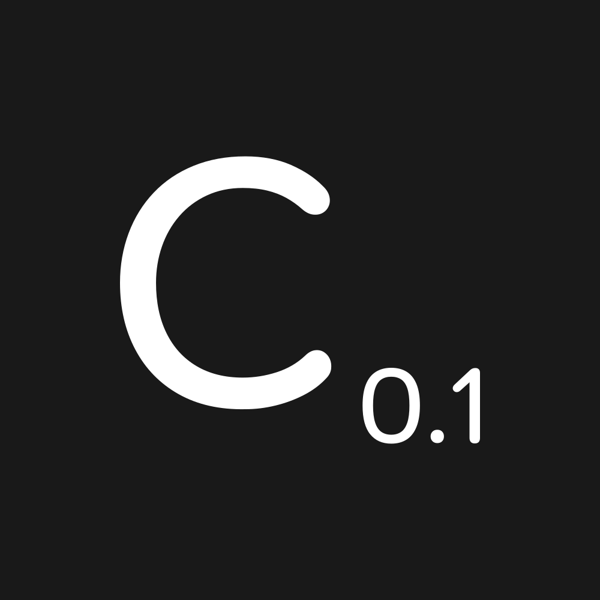
  </picture>

# Community Lab IDE

**A province you can run. On your machine.**

An independent desktop IDE for actuarial agent-based simulation: a small South African province where every
person is an agent living on published mortality and fertility bases, every rand is posted to double-entry books,
a burial society carries the risk, and a workbench of files runs provinces, paired experiments and scripts
against it. It runs offline; a local model scripts the conversations.


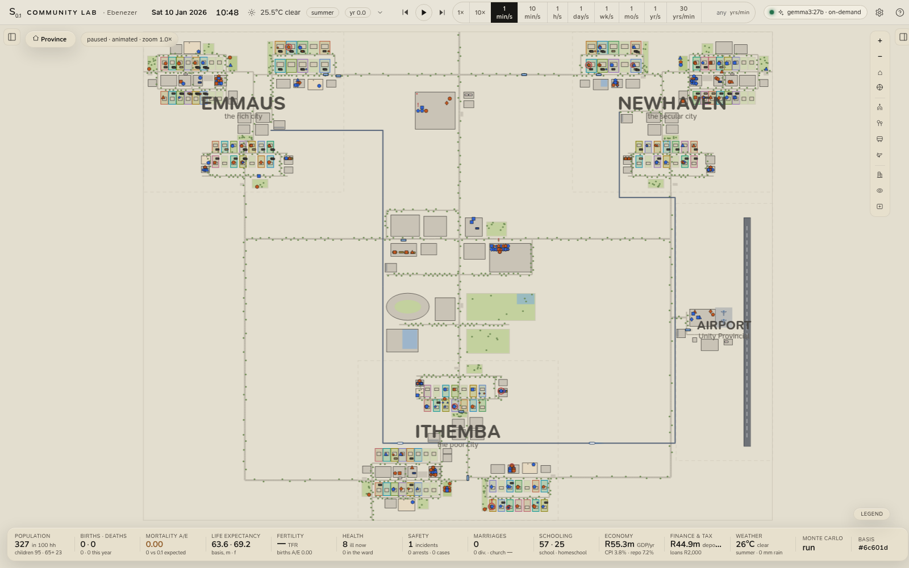

<sub>The province on a Saturday morning. Three cities of three settlements each, every household in its own colour, joined by the N1 across the top, Central Avenue down the middle, Unity Boulevard through the CBD and the ring roads down to Ithemba — every building reaches every other by road — and by the Hyperline, the steel-blue guideway that calls at Emmaus, Unity Central, Ithemba, the airport and Newhaven.</sub>

| | |
|---|---|
| 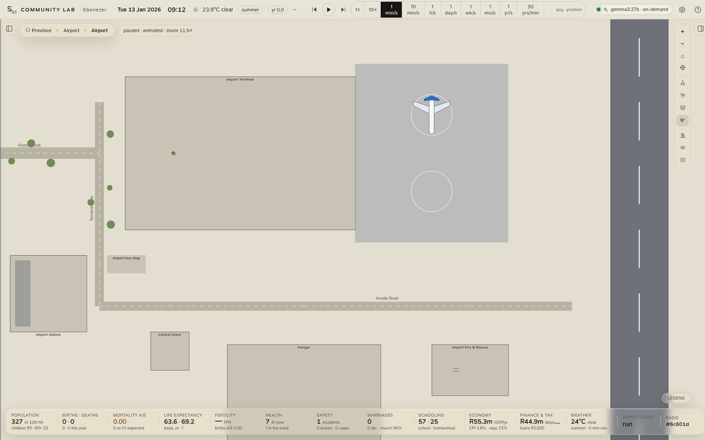 | 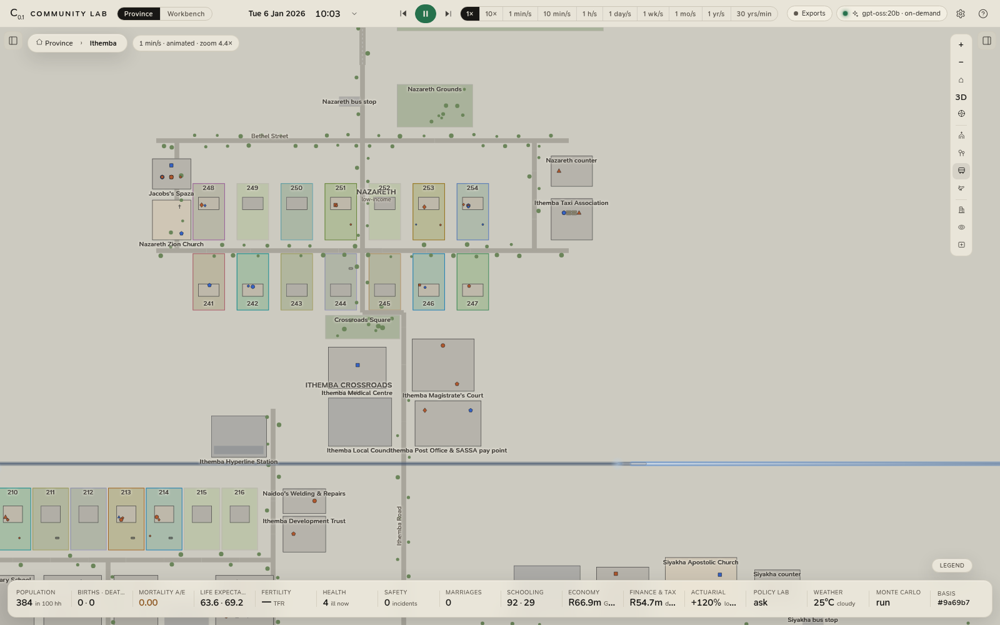 |
| <sub>The airport at 09:12 on a Tuesday: the 09:10 departure taxiing out to the runway while the other aircraft waits on its stand; the Airport station and the shuttle's bus stop are across Terminal Drive from the terminal.</sub> | <sub>The Hyperline between stations: launched to Mach 5 (a slider in the basis) within a platform's length, so a hop is over in about a second of simulated time — the renderer stretches it into a half-second streak along the guideway. Empty places, here the plots whose households are out, are drawn slightly greyed.</sub> |

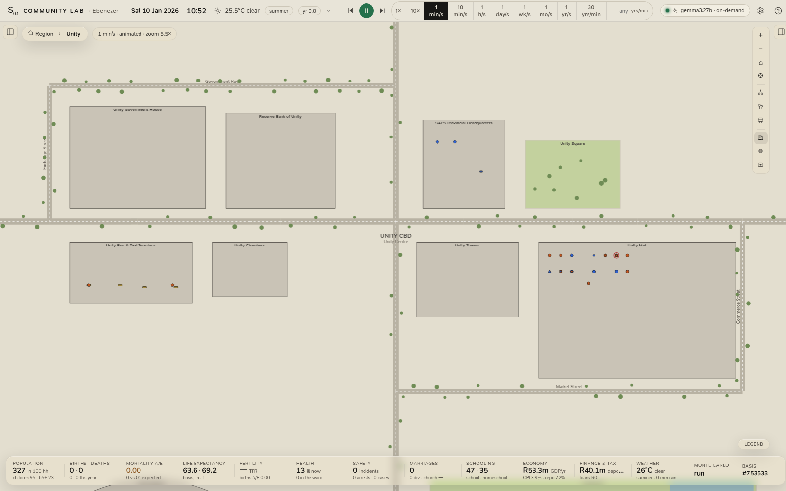

<sub>The CBD at 10:30 on a Saturday: Government House, the Reserve Bank, SAPS provincial headquarters and Unity Square north of Unity Boulevard; the terminus with its minibuses, Unity Chambers, the towers and the mall — full of shoppers from all three cities — south of it.</sub>

</div>

---

## Download

Installers are on the [**Releases tab**](https://github.com/intelligentactuaries/community-lab/releases), and
[intelligentactuaries.com/community-lab](https://intelligentactuaries.com/community-lab) always links each
platform's newest build.

| Platform | Installer | Notes |
|---|---|---|
| Linux (Ubuntu 22.04+, Debian 12+), x64 | `Community-Lab-IDE-<version>-amd64.deb` | `sudo apt install ./Community-Lab-IDE-<version>-amd64.deb` |
| Linux, x64 | `Community-Lab-IDE-<version>-x86_64.AppImage` | `chmod +x` it and run it. Needs FUSE 2 (`sudo apt install libfuse2t64`, or `libfuse2` before 24.04). Updates itself. |
| Windows 10/11, x64 | `Community-Lab-IDE-<version>-x64.exe` | Not code-signed yet: SmartScreen warns on first launch (**More info → Run anyway**). |
| macOS 14+, Apple Silicon | `Community-Lab-IDE-<version>-arm64.dmg` | Not notarised yet: clear the quarantine flag once, `xattr -dr com.apple.quarantine "/Applications/Community Lab IDE.app"`. |

Everything the IDE needs ships inside it: the engine (a compiled Bun server with its worker pool), the client, the
3D people. Nothing is fetched at run time. For conversations scripted by a model, install
[Ollama](https://ollama.com) and `ollama pull gpt-oss:20b` (or pick any other model, or a hosted provider, in
Settings); the simulation itself needs no model. [docs/INSTALL.md](docs/INSTALL.md) has the details: where your
data and logs live, updates, uninstalling.

## Two views

**The province** is the simulation, live: the map of Unity Province with every resident on it, the 3D close-up
past the room plans, the analytics drawer along the bottom (population, mortality A/E, fertility, health, the
economy, the books and tax, the actuarial workbench, the burial society, safety and the court, the policy and
stress lab, Monte Carlo), the inspector for any person, household or building, and the clock that runs from real
time to thirty years a minute.

**The workbench** is the IDE around it: a folder of files you choose (a *workspace*), an editor that knows their
shapes, and a run for each kind of file.

| File | What running it does (Ctrl+Enter) |
|---|---|
| `*.province.json` | Rebuilds the province on it: a seed, the basis (only what differs from the defaults), and optionally a mortality table (a CSV in the workspace) and timed shocks. |
| `*.experiment.json` | A paired experiment on the local worker pool: the baseline and up to six arms on the same seeds (common random numbers), 21 indicators with 95% intervals; the result is kept in `results/`. |
| `*.js` | A script, run in a worker beside the editor with the engine at hand: `province()`, `experiment()`, `monteCarlo()`, `pooledExperience()`, `print`, `table`, `plot`, `readFile`, `writeFile`. |

```js
// A/E by age in a few lines (the sample's scripts/ae-by-age.js bands it and saves a CSV)
const p = await province({ seed: 'ae-by-age' });
p.run({ years: 5 });
const rows = p.experience({ ageWidth: 10 });   // deaths, person-years, expected deaths by year, age and sex
table(rows);
plot({ x: rows.map((r) => r.age), series: { 'A/E': rows.map((r) => r.deaths / r.expected_deaths) } });
```

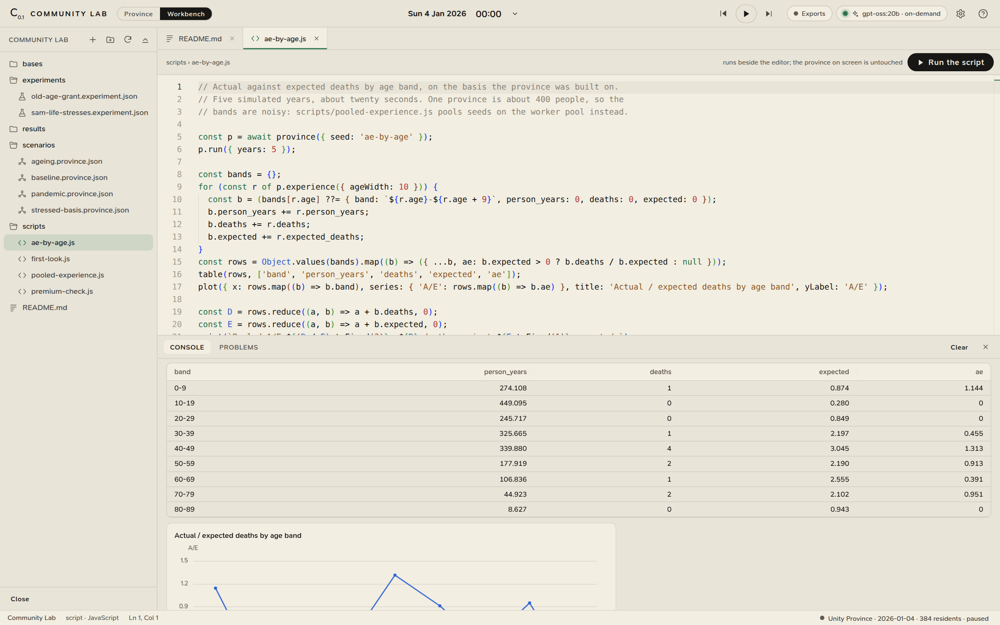

<sub>The workbench after running the sample's <code>scripts/ae-by-age.js</code>: five simulated years of a province of the script's own, A/E by ten-year band in the Console, the table saved to <code>results/</code>. One province is about four hundred people, so the bands are noisy; <code>pooled-experience.js</code> pools sixteen seeds on the worker pool instead.</sub>

File › New Workspace writes a sample to start from: four provinces, two experiments, four scripts and a mortality
table, every one runnable. [docs/WORKBENCH.md](docs/WORKBENCH.md) is the full reference: both file formats, the
script API, and the shortcuts.

## What it is

Community Lab drops you into *Unity Province*: three cities, the centre they share and an airport. *Emmaus* is the original district grown rich — the
Hebron Heights estates, affluent Ebenezer, comfortable Kanana — with a church in every settlement.
*Newhaven* is its secular mirror: affluent Bellevue Heights, middle-class Oakdale, working-class Westbrook,
a library and a memorial hall where the congregations would be, Sundays in the park, civil weddings at the
court. *Ithemba* is poor and devout: three townships, three churches, spazas, a communal farm. Between them
lies *Unity Centre* — the central hospital that takes every city's surgery and specialist referrals, the CBD
with Government House, the Reserve Bank, the provincial police, the mall and the towers, and Unity Park with
its stadium, concert hall, Grand Park and sports centre — and a road network that joins every city to every
other directly and through the centre. South-east of it all is the *provincial airport*: a terminal, a control
tower, a hangar and a 1.6 km runway. Each resident is a **classical shape** — circle, square, triangle,
hexagon, diamond or pentagon for their dominant Big Five trait — coloured by sex, sized by age, ticked by
education, ringed when ill or grieving, lettered by profession when you zoom in. They sleep, eat, work, go to
school (or are homeschooled), shop at the market or the mall, visit friends, worship on Sunday where there is
a church (households go together, so the service is close to universal at ~92 % of the church-going cities'
residents; the pastor preaches, the whole congregation sings the hymns, then it breaks into fellowship
groups), go to the Saturday match and the concert, court, marry, have children, fall ill and are treated at
their city's clinic or referred to the central hospital, grow old and die on a published mortality basis.
Getting about is its own layer: households drive their cars (the estates run to one per driver); anyone else
takes the **Hyperline** — the province's train, two of them shuttling on an elevated guideway that calls at
Emmaus, Unity Central, Ithemba, the airport and Newhaven — or a **bus** on one of the four lines into the
terminus, or hails a **minibus taxi**; **ambulances** fetch the admitted from home and attend the worst road
accidents; two **aeroplanes** fly five return trips a day and the executives, bankers and professionals fly out
for the day and come home on an evening flight. No child under ten is ever left without someone of fourteen or
older: a neighbour or grandparent comes to mind them while the parents work, or the child goes along. Intruders arrive from outside — burglars, pickpockets, drunk troublemakers, stray dogs, snakes, con
artists, stock thieves, veld fires, strangers asking for help — and the nearest police station, the pastor,
the doctor and the neighbours respond. Disputes are talked out, mediated by the pastor where there is one, or
end in a fight, an arrest and a hearing at the city's magistrate's court. Funerals fill the church (or the
memorial hall) and a grave appears in the city's cemetery; weddings end with a reception in the hall.

Time runs from **real time** to **thirty years in a minute**. Up to an hour per second the village is
animated (people walk the roads, drive the family car, hold conversations you can zoom into and watch line
by line); faster than that it becomes a time-lapse of the daily demographic, health and economic processes.
Both modes run the same day-step pipeline, so outcomes never depend on the speed you watch at.

Underneath the village runs a real economy. Every rand is posted to **double-entry books** (a standard
chart of accounts, a hash-chained general journal, ledgers, trial balance, income statement, balance sheet,
cash-flow statement, year-end close at the end of February): salaries with **PAYE, UIF and SDL** on the
2026/27 SARS tables, SASSA grants, household budgets split by category with **VAT** and fuel levies, tithes,
premiums, the shop's stock, the farm's produce sold into a **local market that clears against demand** and
import parity, the workshop, the co-operative, the church's diaconal fund, and the community's own
**Mutual Bank** (deposits, loans with IFRS 9 staging, capital adequacy and liquidity returns, dividends on
member shares). SARS gets its returns: EMP201, VAT201, provisional tax, ITR12 assessments in tax season,
penalties and interest when someone cannot pay. The macro block reads the same books: CPI, a Taylor-rule
repo rate, GDP by three approaches, AD–AS by quarter, Phillips and Okun, the circular flow, Lorenz and Gini,
a Laffer curve. None of it clutters the village: two tiles open one workspace.

## What it looks like

|  |  |
|:--|:--|
| 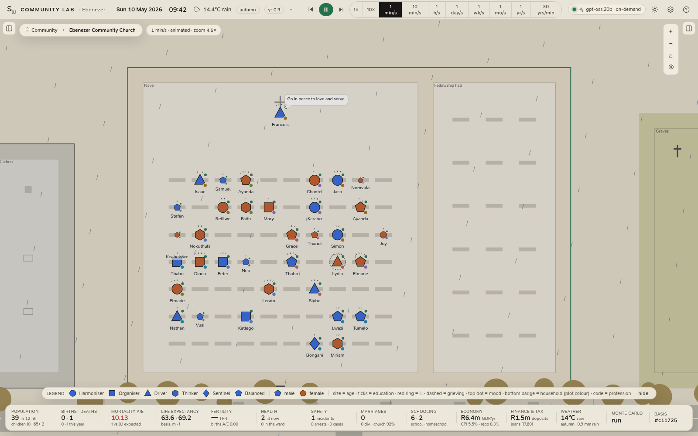 | 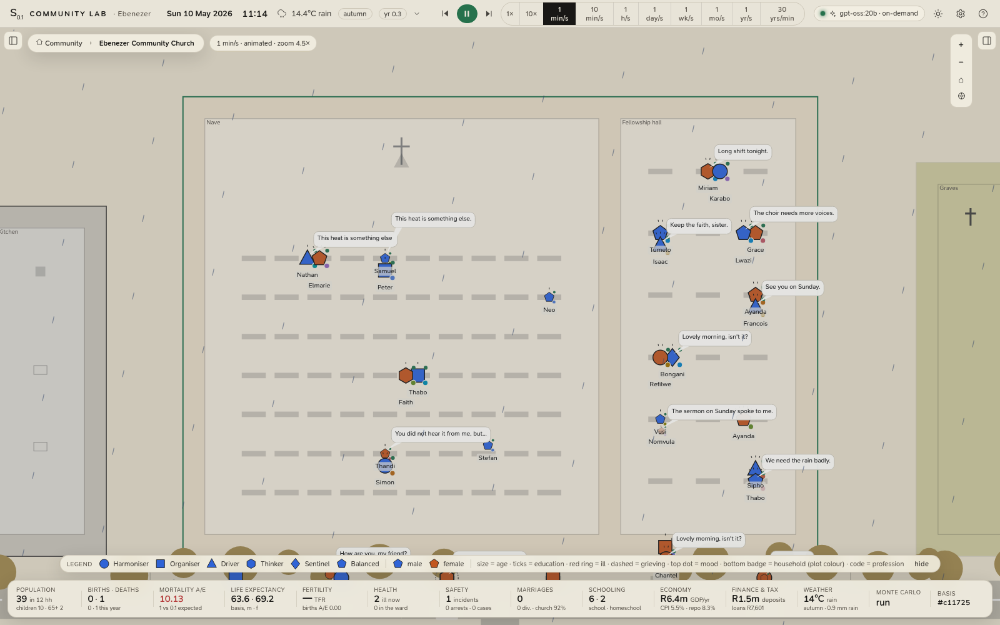 |
| **The Sunday service.** The pastor preaches from the pulpit without a break while the congregation sits in the pews, and every twenty minutes or so calls a hymn that the whole room sings — about nine in ten of those present, the rest standing and listening. Households decide together whether to go, so attendance runs at about 92 % of residents. | **Fellowship afterwards.** The congregation spreads across the fellowship hall, the churchyard and the nave and breaks into twos and threes, with roughly nine in ten of those present in a conversation. |
| 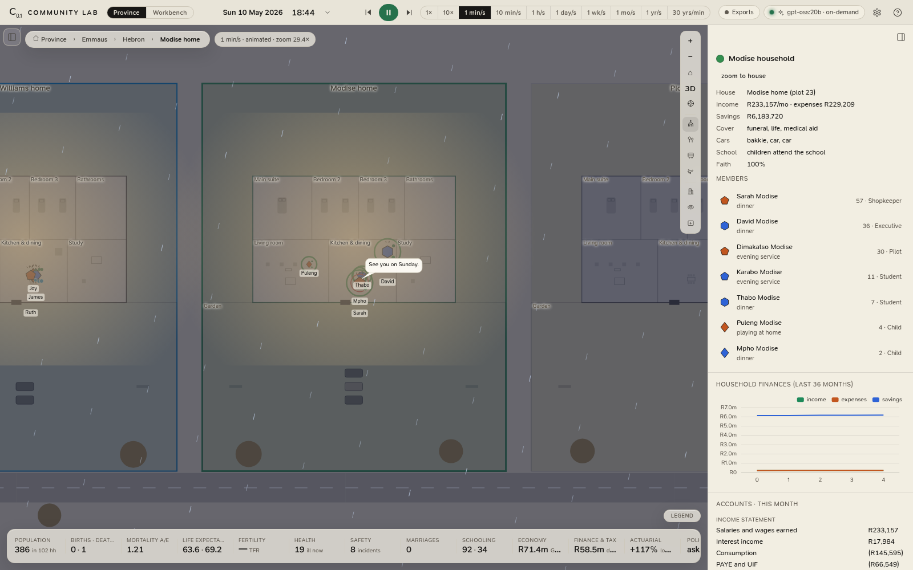 | 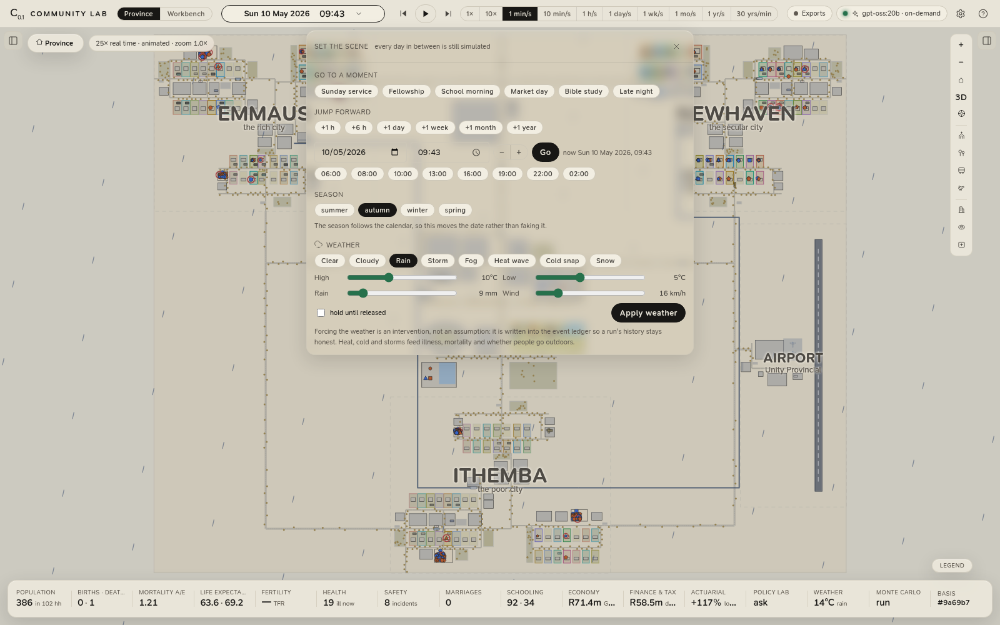 |
| **Inside a household.** Drill in far enough and the roof comes off: living room, kitchen, bedrooms, yard. Each plot has its own colour, worn by the house and by a badge on every one of its residents. The inspector carries the household's income, cover, schooling and savings. | **Directing the scene.** Jump straight to the Sunday service, fellowship, a school morning or market day, hop forward by an hour or a year, move to the start of a season, or force a storm, a heat wave or a cold snap and watch the community respond. |

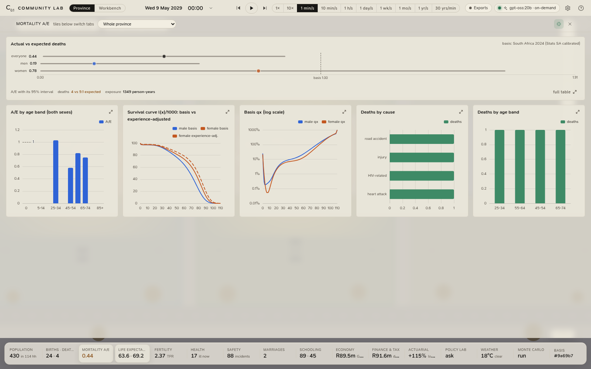

<sub>The analytics drawer, full screen. Actual versus expected deaths by age band and sex with Poisson intervals, survival curves against the basis, the assumed q<sub>x</sub> on a log scale, and deaths by cause. Every tile in the strip along the bottom opens its own tab.</sub>

|  |  |
|:--|:--|
| 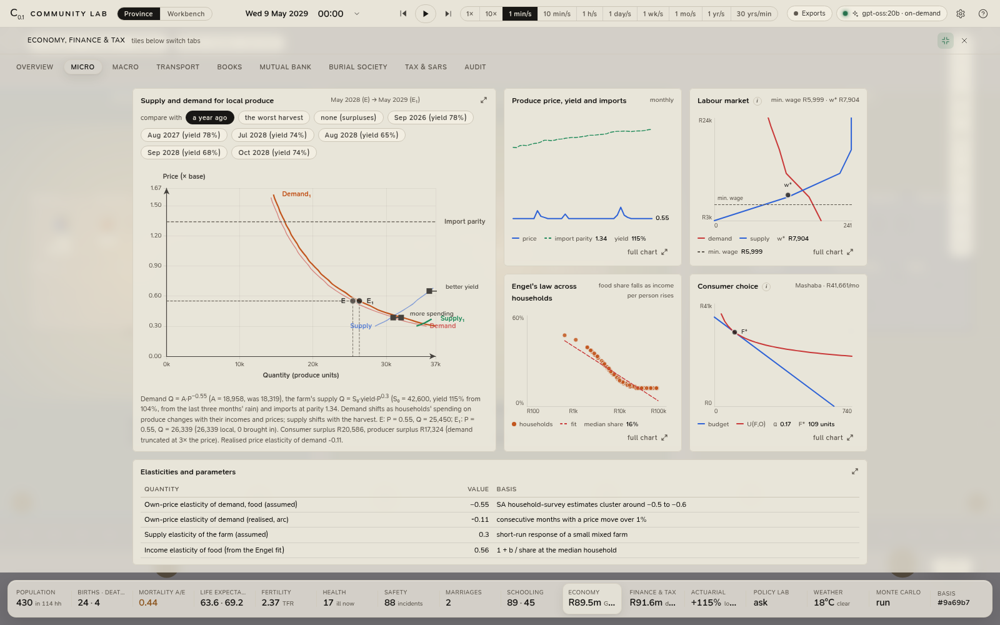 | 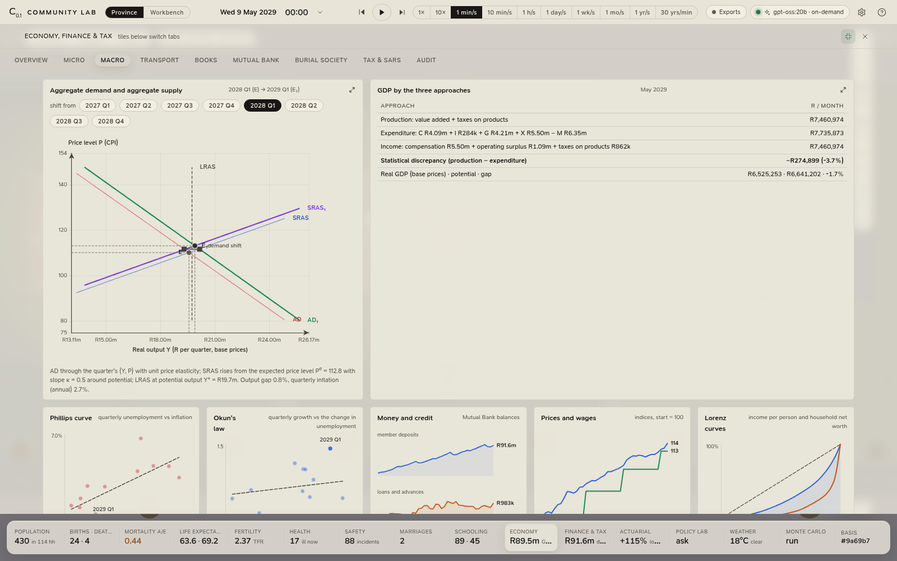 |
| **Micro.** Supply and demand for the farm's produce as the textbook draws it: both curves for the month and for a month you choose (a year ago, the worst harvest), E and E₁, a shift arrow for each curve with its cause, consumer and producer surplus shaded in the single-month view, import parity as the ceiling. Below it the labour market with the minimum-wage floor, Engel's law across households and a household's budget line and indifference curve. | **Macro.** AD–AS for any two quarters (E → E₁), GDP by production, expenditure and income with the statistical discrepancy stated, the Phillips curve and Okun's law fitted by OLS, the fiscal position by tax head, money and credit, Lorenz curves and a Laffer curve. |
| 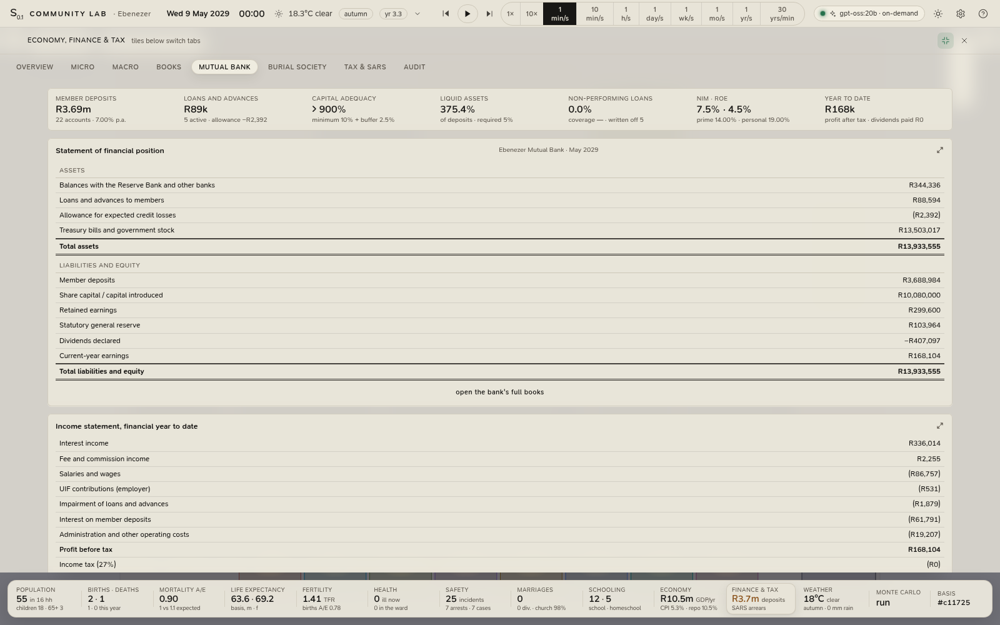 | 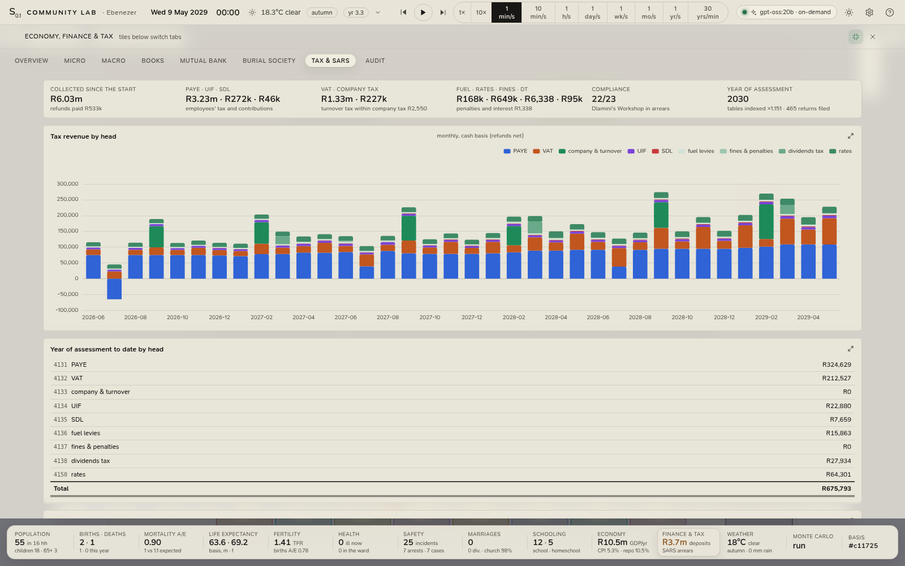 |
| **The Mutual Bank.** Balance sheet and income statement, deposits and advances, the loan book with its IFRS 9 stage and days past due, the amortisation schedule of any loan, and the quarterly return to the Prudential Authority (capital adequacy, liquid assets, non-performing loans, large exposures). | **Tax & SARS.** Collections by head, the 2026/27 tables in force (indexed by the community's own CPI in later years), the average tax rate of every assessed taxpayer against the statutory schedule, compliance status, and the register of every EMP201, VAT201, IRP6, ITR14, TT03, ITR12 and DTR01 filed. |

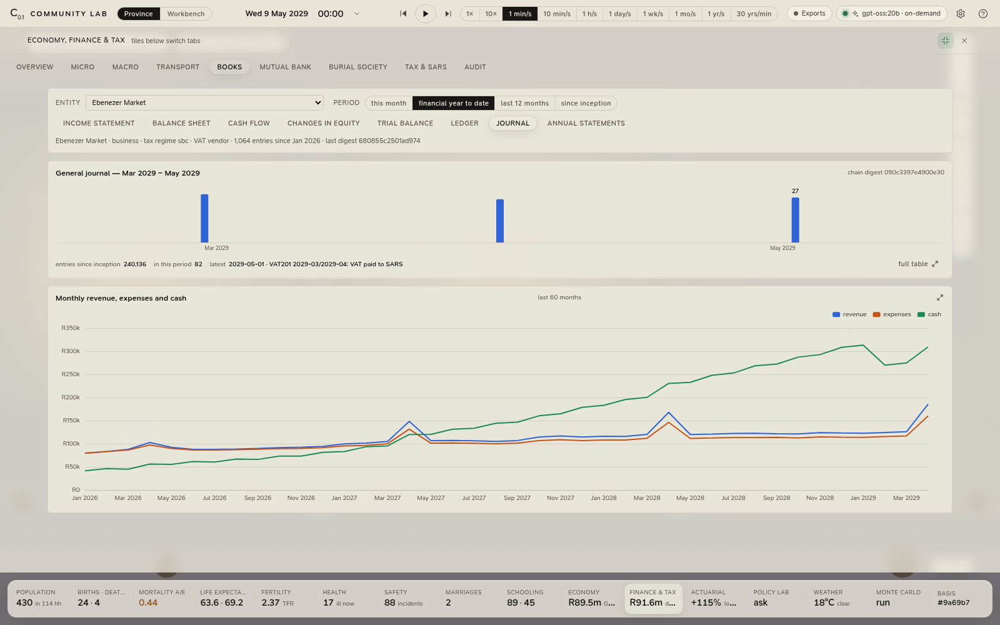

<sub>The books. Any entity's journal, ledgers and statements; every entry carries the digest of the one before it, and the Audit section re-verifies the chain and checks that every trial balance balances, every balance sheet balances, every cash-flow statement reconciles and the bank's books agree with its members'.</sub>

## For actuaries

* **Explicit basis.** Every rate is a parameter (the left panel, or a province file in the workbench) and the whole basis is hashed onto every export.
  Mortality is Heligman–Pollard with presets from a real rural South African HDSS (Agincourt, pre-ART and
  ART era) and a Stats SA 2024-calibrated table; fertility is an ASFR schedule scaled to the published TFR.
  See [`docs/ASSUMPTIONS.md`](docs/ASSUMPTIONS.md) for every number and its provenance.
* **Experience analysis.** Person-years of exposure and expected deaths accrue daily by age band and sex;
  the analytics drawer shows A/E with 95 % intervals (the normal approximation to the Poisson), survival curves (basis vs experience-adjusted),
  realised ASFR/TFR and a births A/E, deaths by cause and band, illness seasonality.
* **Risk theory in miniature.** A community burial society with funeral and life cover: premiums in, claims
  out, the reserve's surplus path and a ruin flag. The Monte Carlo tab runs N seeds × Y years on the server
  and reports percentiles and the ruin probability.
* **An actuarial workbench.** The *Actuarial science* tab of the analytics drawer, in the International
  Actuarial Notation and valued at a rate you pick from the province's own (treasury bills, repo, prime, the
  deposit rate, a real rate, or your own): the theory of interest (i, v, d, δ, i⁽ᵐ⁾, aₙ|, äₙ|, sₙ|, (Ia)ₙ|,
  cash-flow timelines with PV and AV, a loan's schedule and yield); life contingencies on the scenario's table
  (lₓ, dₓ, μₓ, e̊ₓ, the commutation functions Dₓ Nₓ Cₓ Mₓ, Aₓ, äₓ, term and endowment functions, net premiums
  and prospective reserves ₜV); the society priced by the equivalence principle (natural against level
  premiums, the pure premium by age against the flat premium, who subsidises whom, loss and combined
  ratios, IFRS 17's LRC and LIC); classical risk theory (the compound-Poisson surplus, the safety loading θ,
  the adjustment coefficient R, Lundberg's bound and the Cramér–Lundberg approximation, a simulated
  ten-year fan of the surplus, ψ(u) against capital, and the SAM one-year 99.5 % SCR with its MCR corridor
  and the standard formula's life stresses beside it); a cohort-component projection of the province with
  mortality improvement, projected pyramids and the dependency ratio; a worker's defined-contribution fund
  with the two-pot split, the annuity it buys and the replacement ratio; the old-age grant as a
  closed-group social-security liability; and the standards behind each figure (SAM, IFRS 17, IAS 19, the
  ISAPs, ASSA's SAP 901, SAP 201, APN 105 and APN 207, the Acts).
* **Reproducibility.** Named RNG streams (common random numbers): change one assumption and only that
  process's draws change. Same seed, same village, same history — on Bun, in the browser, in a worker.
* **Experience, measured against its basis.** Individual risk multipliers are normalised within each age band
  and the table share falls with age as modelled illness deaths rise. Those constants were fitted when the
  community was a single village and have not yet been refitted for the province: pooled over many seeds, the
  province's A/E on the default basis is about 0.85, close to 1 below 45 and about 0.7 from 75 (measured on
  0.1.0; the figures are in `docs/ASSUMPTIONS.md`).
* **Accounting-standard records.** Every economic event is a balanced journal entry on a standard chart of
  accounts; statements are presented on IFRS for SMEs lines; the general journal is hash-chained and the
  audit section re-verifies it. Tax follows the SARS 2026/27 tables (Budget 2026), the UIF and SDL Acts, the
  VAT Act, s12E and the Sixth Schedule, and the Tax Administration Act's penalty regime; the bank follows the
  Mutual Banks Act with IFRS 9 expected credit losses and Basel I risk weights.
* **Documentation.** The model is described with the ODD protocol in [`docs/ODD.md`](docs/ODD.md).

## Using it

| Do | How |
|---|---|
| Play / pause, step an hour | top bar, or <kbd>space</kbd> |
| Change speed | segmented control (1× … 30 yrs/min), or keys <kbd>1</kbd>–<kbd>0</kbd> |
| Drill in | scroll to zoom; **double-click a house** for its interior; **double-click a person** to follow them; the breadcrumb (Province › City › Settlement › House › Person) steps back out (<kbd>Esc</kbd>); the fly-to buttons on the right jump to a city, the airport, the CBD, Unity Park or the hospital. Past the rooms the map becomes a 3D scene: the moment it has the picture the camera swings down from straight above to a low view along the street, and coming closer only brings it nearer, to eye level |
| Get about the 3D scene | Unreal Engine's viewport controls, with Unreal's own numbers: **right button** looks about (0.2° a pixel), **left button** moves along the ground and turns, **middle button** (or left + right) slides sideways and straight up and down; <kbd>Alt</kbd> (or <kbd>Ctrl</kbd>) with a button orbits, dollies or tracks about what the camera looks at; the **wheel** dollies toward the ground under the cursor, or with a button held sets the camera speed (×1.1 a notch); with a button held <kbd>W</kbd><kbd>A</kbd><kbd>S</kbd><kbd>D</kbd> fly, <kbd>E</kbd>/<kbd>Q</kbd> up and down, <kbd>R</kbd>/<kbd>F</kbd> the camera's own up and down, <kbd>C</kbd>/<kbd>Z</kbd> zoom the lens (it springs back); the arrows, <kbd>PgUp</kbd>/<kbd>PgDn</kbd> and the numpad work without a button; <kbd>Home</kbd> levels the view. Speed, scroll speed, sensitivity, inversions and the WASD mode are in Settings. A game controller follows the editor's joystick controls. Flight accelerates and coasts as Unreal's does; everything scales with the distance to what the camera looks at |
| Watch a conversation | zoom to two people talking (dashed line between them); the inspector shows the transcript; **Script with AI** asks the model to write it from their personalities, relationship, mood and recent events (or switch dialogue to *automatic* in Settings) |
| Talk to a resident | select a person → *Talk to …* in the inspector (in character, from the simulation state) |
| Direct the scene | click the **clock** in the header: jump to the Sunday service, fellowship, a school morning, market day, a date or a season, and force the weather (storm, heat wave, cold snap) to see how the community responds. Days in between are still simulated; a forced sky is recorded in the event ledger |
| Change the scenario | *Scenario & basis* in the left panel → Rebuild province; or write a province file in the workbench and run it |
| Analytics | the bottom strip is the navigation: every tile opens its detailed tab (click the lit tile again to close). The ⤢ button in the drawer header makes it full screen so every chart of a tab fits without scrolling |
| Actuarial workbench | the **Actuarial** tile (its figure is the society's premium loading over the pure risk premium): sections for interest, life contingencies, pricing, risk & solvency, projections, retirement & grants and standards; the valuation rate chips at the top of the rail revalue everything; the scope picker's person becomes the life, and the worker, the sections describe |
| Economy, books, bank and tax | the **Economy** tile opens the workspace at the overview (micro and macro alongside); the **Finance & tax** tile opens it at the Mutual Bank (books, burial society, SARS and audit alongside). A household's inspector shows its accounts and opens its ledger; select the bank building on the map for its balance sheet; a person's card shows their payslip and SARS position |
| Tell households apart | every plot has a fixed colour: the plot border and tint, the small badge at the bottom-right of each resident's shape, the chips in the lists and inspector. Select a household (or a person) and all its members get a halo wherever they are in the province |
| See who is where | any place with nobody in it — a house whose household is out, a weekday church, a shop after hours, a parked car or an empty bus — is drawn slightly greyed; the colour comes back when someone is inside |
| Choose the AI model | the model chip in the top bar, or Settings |
| Export the data | the **Exports** chip in the top bar: experience, the person-year panel, the burial society's book, the economy, each with its provenance; to CSV, JSON or a folder of the workspace |
| Live on your own table | Exports › *Import a mortality table (CSV)*, or `"mortality": "bases/your-table.csv"` in a province file |

## Community Lab and Scelo IDE

Community Lab also ships inside [Scelo IDE](https://github.com/intelligentactuaries/scelo), the actuarial
workbench, where it is joined to Scelo's soft data, tools and hard data pipeline. This repository is Community
Lab as an application of its own: it needs neither Scelo nor its agent swarm, and runs its engine on its own port
(3040; Scelo's bundled copy keeps 3020), so the two can be installed side by side.

The two speak the same file format. Every export here (experience with its true basis, the person-year panel,
the burial society's model points, the economy, experiment results) is written in the open `scelo.exchange/1`
layout (`src/shared/exchange.ts`): plain tables with a data dictionary and their provenance, so Scelo, R, Python
or a spreadsheet can read them as they are.

## Build it yourself

Prerequisites: [Bun](https://bun.sh) ≥ 1.1. On Linux, packaging a `.deb` also needs the usual
[electron-builder prerequisites](https://www.electron.build/multi-platform-build).

```bash
git clone https://github.com/intelligentactuaries/community-lab.git
cd community-lab
bun install

bun run dev                    # the dev pair: API on http://127.0.0.1:3040, UI on http://localhost:5195
bun test                       # the engine's tests (determinism, bases, books, workspace safety, the sample)
bun run typecheck

bun run desktop:install        # the desktop app's own dependencies (Electron, electron-builder)
bun run build                  # the client, which the engine serves to the desktop app in development
bun run desktop:dev            # the desktop app, its engine run from the source with bun
bun run desktop:dist:linux     # desktop/build/: the AppImage, the .deb and latest-linux.yml
```

`desktop:dist:win` and `desktop:dist:mac` build the other platforms (Bun cross-compiles the engine for any target;
electron-builder is happiest on the target OS). Releases are built and attached by the workflows in
`.github/workflows/`; [docs/RELEASING.md](docs/RELEASING.md) is the checklist.

Other commands:

```bash
bun scripts/batch.ts --seeds 20 --years 30 --out data/batch.csv   # Monte Carlo from the command line
bun scripts/calibrate.ts --fit             # re-derive the mortality presets from their targets
bun scripts/smoke.ts 5                     # five simulated years, printed summary
bun scripts/build-embed.ts                 # the engine for web pages (dist-embed/)
```

## Repository layout

```
src/sim/          the engine (pure TypeScript, no DOM): rng · time · types · params · mortality · fertility
                  personality · population · world · institutions · schedule · movement · transit · health
                  social · security · economy · demography · stats · weather · engine · batch · shocks
                  experience · patch · experiment
src/sim/layout/   the province's geography: emmaus · newhaven · ithemba · unity · hyperline · airport
src/sim/finance/  accounts (double-entry, statements, audit chain) · posting · tax (SARS) · bank · macro · micro
src/shared/       exchange (the data contract) · exports · templates · files (the workbench's formats)
                  sample (the sample workspace) · mortalityCsv · narrative (dialogue prompts)
src/server/       Bun API: AI providers (Ollama default), streaming dialogue, the worker pool's jobs
                  (experiments, pooled exports, batches), the workspace (workspace.ts), sqlite
src/client/       React + custom CSS: the province (canvas renderer, panels, ECharts analytics; render3d/ the 3D
                  close-up) and the workbench (workbench/: Monaco, the script runtime, the console)
src/embed/        the engine for web pages: a live province in a worker
desktop/          the Electron app: main process, preload bridge, menus, the engine's supervisor, packaging
brand/            the C₀.₁ mark and its generator
scripts/          dev runner, batch, calibrate, smoke, screenshots, the embed build; humans/ builds the people's
                  kit from MakeHuman's CC0 data
tests/            bun test suite
docs/             ODD.md (model description), ASSUMPTIONS.md (basis and provenance), WORKBENCH.md, INSTALL.md,
                  RELEASING.md
manual/           the user manual (MkDocs Material), published at docs.intelligentactuaries.com/community-lab
```

## Status and honesty

This is a v0.1 research instrument. Numbers marked *proxy* in the assumptions file are reasoned
placeholders awaiting better sources; published numbers are cited by release. With about 400 residents every
statistic is still noisy — the intervals say so — which is exactly why the Monte Carlo tab exists.

## Reporting bugs, concerns and security issues

- [GitHub Issues](https://github.com/intelligentactuaries/community-lab/issues) for reproducible bugs and requests.
- **bugs@scelo.ai** for reports you would rather keep off the public tracker.
- **scelo@intelligentactuaries.com** for general concerns.
- Security vulnerabilities: please follow [SECURITY.md](SECURITY.md), not the public tracker.

## License

[Scelo IDE Source-Available License v1.1](LICENSE), the same license as Scelo, word for word. A project of
Intelligent Actuaries (Pty) Ltd.

| Who you are | What you owe |
|---|---|
| Anyone using Community Lab IDE itself (install, modify, fork, distribute) | Nothing. Free for any purpose, including commercial. |
| For each **Licensed Product** you build using it, on its first **ZAR 1,000,000** of lifetime Gross Revenue | Nothing. The first ZAR 1M per product is royalty-free. |
| For each Licensed Product, on Gross Revenue above ZAR 1,000,000 lifetime | A flat **3%** royalty on the excess, annually in arrears, for the lifetime of that product. A [Commercial License](mailto:legal@intelligentactuaries.com) is available as an alternative. |
| Anyone applying the published Nanoeconomics Methodology to **poverty-eradication work** | Free regardless of revenue, conditional on a public annual report to `scelo@intelligentactuaries.com` and `nanoeconomics@scelo.ai`. |
| Anyone who misrepresents revenue, product boundaries, or carve-out eligibility | Auto-termination of the offending Product(s) and a back-charge, as the License sets out. |

Read the full text: it covers attribution, royalty reporting, prohibited acts, the abuse remedy, the warranty
disclaimer and the liability cap. Not legal advice: before relying on the license, consult counsel in your
jurisdiction.

The 3D people are made from [MakeHuman](http://www.makehumancommunity.org)'s assets (base mesh, targets,
skeleton weights, clothes, hair, eyebrows, eyelashes, eyes and skins), released under CC0 1.0 by Data
Collection AB, Joel Palmius and Jonas Hauquier; `src/client/render3d/assets/people/` is derived from them by
`scripts/humans/build.py`.

The 3D view's navigation follows Unreal Engine's editor viewport, with the engine's own settings and constants
(read from its configuration and source: mouse sensitivity, camera speed and its wheel steps, the flight
camera's acceleration and damping, the lens keys and their recoil, the joystick scheme); the people's hair
colour uses the melanin and redness model of Unreal's hair shading, and their skin, eyes and levels of detail
take their numbers from MetaHuman's materials and LOD settings. No engine code is included; the constants and
the behaviour are reproduced in TypeScript (`src/client/lib/controls.ts`, `src/client/render3d/hair.ts`,
`humans.ts`, `people3d.ts`). Unreal Engine and MetaHuman are trademarks of Epic Games, Inc.

---

<sub>Community Lab is a project of [Intelligent Actuaries (Pty) Ltd](https://intelligentactuaries.com). Public
methodology, private mandate.</sub>
