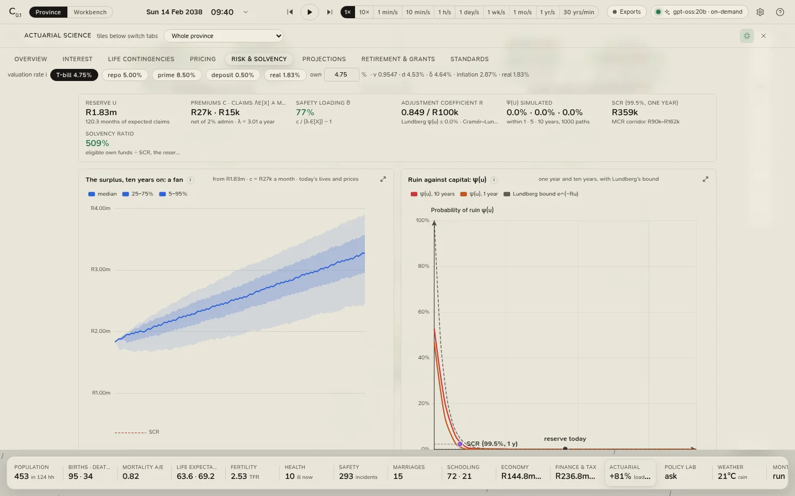

# The actuarial workbench

The **Actuarial** tile opens an actuarial workbench on the province: the theory of interest, life contingencies, the
burial society priced and its risk measured, a projection of the population, a worker's pension and the state's
old-age grant, in the International Actuarial Notation and valued at a rate you choose from the province's own.
Nothing here feeds back into the simulation: the workbench values what the province has produced, on the province's
own basis.

<figure class="cl-shot" markdown>

<figcaption>Risk and solvency: the burial society's surplus, ten years on, as a fan of a thousand simulated paths, against ruin and the solvency capital requirement.</figcaption>
</figure>

## The rail and the rate

Eight sections run down the rail: **Overview**, **Interest**, **Life contingencies**, **Pricing**, **Risk &
solvency**, **Projections**, **Retirement & grants** and **Standards**. At the end of it sits the **valuation rate
i**, which every present value in the workbench uses:

| Choice | The rate |
|---|---|
| **T-bill** (the default) | The treasury-bill rate the Mutual Bank earns: repo less 0.25%. The nearest thing the province has to a risk-free rate. |
| **repo** | The Reserve Bank's repo rate, as the province's committee set it. |
| **prime** | Repo + 3.5%. |
| **deposit** | The Mutual Bank's deposit rate: repo less 4.5%, at least 0.5%. |
| **real** | Treasury bills less inflation: (1 + T-bill) / (1 + CPI inflation) − 1. |
| **own** | Any rate you type, from −50% to 100%. |

Beside it: v, d and δ at that rate, and inflation and the real rate. Choosing a **person** in the drawer's scope
picker makes them the life in *Life contingencies* and the worker in *Retirement & grants*.

**The table** throughout is the province's mortality basis (its preset, or the table it lives on) with mortality
improvement applied to today; commutation functions use a radix of 100,000.

## Overview

The headline figures (the rate, e̊₀ on the basis and on experience, A/E with its interval, the society's premium
against its risk, the safety loading θ and adjustment coefficient R, the reserve against the SCR, and the chance of
ruin within ten years); **the actuarial control cycle**, specify, develop, monitor, applied to the province; **the
notation at a glance**, every symbol with its value now; and **the equivalence principle** in one line.

## Interest

v = 1/(1+i), d = iv, δ = ln(1+i), i⁽¹²⁾ and d⁽¹²⁾, and the real rate by Fisher.

- **A timeline: an annuity-certain**: choose the term (5, 10, 20 or 30 years), in arrear or in advance, and the
  payment; the payments are drawn on a timeline with their present value at 0 and accumulated value at n, and the
  caption checks AV = PV(1+i)ⁿ.
- **Annuity-certain values at i**: aₙ|, äₙ|, sₙ|, s̈ₙ|, (Ia)ₙ|, a⁽¹²⁾ₙ| and āₙ| for terms from 1 to 40 years.
- **R1,000 accumulated over thirty years** at prime, treasury bills and the deposit rate, in nominal and real terms,
  and under the mattress.
- **A loan as a timeline**: the largest loan on the Mutual Bank's book, its schedule, its yield (solved by
  bisection) and its value at i; then the interest and capital in each instalment.

## Life contingencies

Choose the life (an age and a sex, or the person in the scope), a term (10, 20 or 30 years, or to 65), and which
reserve to show (term, whole life or endowment). Sums are per R100,000.

| Figure | Convention |
|---|---|
| qₓ, μₓ, ₜpₓ | μₓ = −ln(1 − qₓ) |
| e̊ₓ, eₓ | e̊ₓ from the life table with a₀ = 0.1 and deaths at mid-year elsewhere; eₓ curtate |
| Aₓ, A⁽¹²⁾ₓ, Āₓ | Benefits at the end of the year of death; A⁽¹²⁾ and Ā under a uniform distribution of deaths: (i / i⁽¹²⁾)Aₓ and (i / δ)Aₓ |
| äₓ, aₓ, ä⁽¹²⁾ₓ | Premiums annually in advance; ä⁽¹²⁾ by Woolhouse to the first order, äₓ − 11/24 |
| A¹ₓ:n|, ₙEₓ, Aₓ:n| | Term, pure endowment, endowment |
| Net premiums | Term and whole life, annual and monthly; endowment, annual |
| ₜV | Prospective net premium reserve |

Cards: **the life table** (lₓ and dₓ), **the force of mortality and the rate** on a log scale, **expectation of
life by age**, **Aₓ and äₓ by age**, **the net premium reserve ₜV** over the term, and **the commutation functions**
Dₓ, Nₓ, Cₓ, Mₓ, with Aₓ and äₓ, from the chosen age.

## Pricing

The burial society priced by the equivalence principle. Its basis: a funeral premium per covered household and a
life premium per covered adult of 18 to 64, the funeral benefit and life cover, all indexed by CPI, and
administration of 2% of premiums.

The **pure risk premium** of a covered life is its monthly probability of death, q⁽¹²⁾ = 1 − (1 − qₓ)^(1/12), times
its cover (the funeral benefit, plus the life sum for an adult of 18 to 64). The **implicit loading** is what the
society charges over the sum of the pure premiums, less 1.

- **Natural premium against level premium**: for a man of 25 over forty years, the natural premium each year
  against the level premium, with the reserve built and then drawn between them.
- **The pure monthly premium by age**, by sex, against the flat premium every member pays.
- **Who subsidises whom**: every covered household, what it is charged against its pure premium, and what a
  risk-rated premium would be; the most subsidised first.
- **Premiums and claims by year**, with the loss and combined ratios; **what a claim looks like**, the mix of claim
  sizes.

The section's notes set out IFRS 17's liability for remaining coverage and for incurred claims; for monthly cover
like the society's, both are small, and the workbench describes them rather than computing them.

## Risk and solvency

Classical risk theory on the society as it stands today: monthly premiums **c**, net of administration; claims a
compound Poisson process with **λ** expected claims a month and the society's own mix of claim sizes.

- **Safety loading** θ = c / (λE[X]) − 1.
- **Adjustment coefficient** R solves λ(M_X(R) − 1) = cR (by bisection; it exists only when θ > 0). **Lundberg's
  bound** on the probability of ruin is ψ(u) ≤ e^(−Ru), and the **Cramér–Lundberg** approximation is C·e^(−Ru).
- **The surplus, ten years on: a fan**: 1,000 simulated paths of 120 months from today's reserve, in today's money
  and with today's lives, with their 5th to 95th percentiles; ruin is the reserve below zero at a month end.
- **Ruin against capital**: ψ(u) within one and ten years, simulated, against Lundberg's bound, from no capital to
  well past the SCR.
- **The SCR**: the 99.5th percentile, over the simulated paths, of the worst fall in the surplus at any month end in
  the next twelve months. The MCR corridor is 25% to 45% of it. The **solvency ratio** is the reserve over the SCR.
- **Capital and premium: the fix**: the capital that would meet the SCR (or a 150% ratio), and the premium that
  would bring Lundberg's bound to 1% at today's reserve.
- **The standard formula, in the society's terms**: SAM's mortality stress (+15% of a year's expected claims) and
  catastrophe stress (1.5‰ of the sums at risk), combined with a correlation of 0.25, beside the simulated SCR.

## Projections

A **cohort-component projection** of the province, by single age and sex, for 10, 20, 30 or 50 years: survival on
the improved table year by year, births from the fertility schedule at the basis TFR split at the sex ratio at
birth, the young adults' emigration, and no arrivals. It gives the projected **population**, its **pyramid** now and
at the horizon, **births and deaths** a year, **life expectancy** with improvement and the **dependency ratio**, and
a table every five years. It is a deterministic expected path, not a simulation.

## Retirement and grants

**A worker's fund and pension.** Choose the worker (the median earner by default, or the person in the scope), the
**contribution** (1% to 40% of pay; 15% by default, employee and employer together) and the **return**: cash (the
deposit rate), bonds (treasury bills + 1%), balanced (CPI + 5%, the default) or the valuation rate. Pay grows at
inflation plus real wage growth until the retirement age.

At retirement the fund is split by the **two-pot** system: a third to the savings pot, two thirds to the retirement
pot, which buys a pension, level at the valuation rate or inflation-linked at the real rate, as the retirement pot
over 12ä⁽¹²⁾ at the retirement age. The **replacement ratio** is the pension over the final salary, and a chart
shows how it moves with the contribution rate.

**The old-age grant's liability.** The state's grant (R2,400 a month by default) valued as a closed group, the
people alive today, at the real rate: an immediate annuity for those of 60 and over, a deferred one for the rest;
by age band, against GDP. It values the grant for everyone, whereas the province pays it only to those of 60 and
over without an income of their own, so it is the liability if every pensioner qualified.

## Standards

**The standards behind each figure**: the actuarial control cycle; ISAP 1 and ASSA's SAP 901; the Insurance Act and
the Prudential Standards (SAM); microinsurance and the Friendly Societies Act; IFRS 17 with ISAPs 4 and 7; IAS 19
with ISAP 3 and APN 207; the Pension Funds Act, SAP 201 and the two-pot system; ISAP 2 for social security; APN 105
on AIDS mortality; ISAPs 5 and 6; and experience analysis as the CMI and SOA practise it. Then the **standard
formula's life module**, stress by stress, and how the workbench uses each standard.
