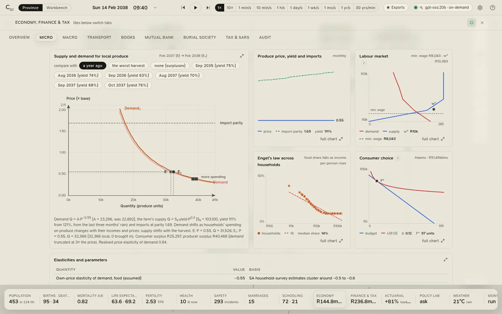
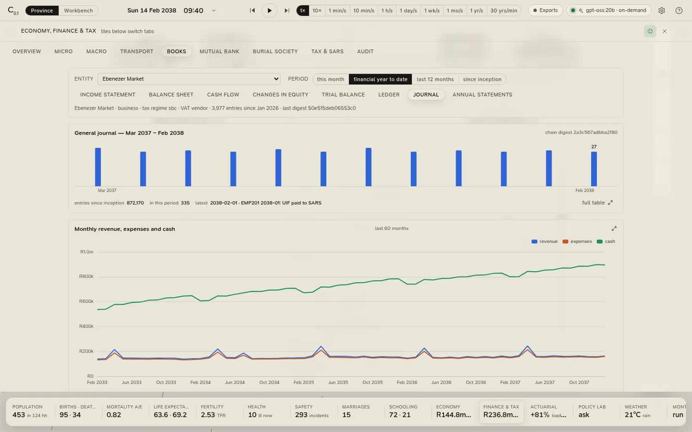

# Economy and finance

Under the province runs a real economy, and every rand of it is posted to double-entry books. The **Economy** tile
opens the finance workspace at its overview; **Finance & tax** opens it at the Mutual Bank. Nine sections run down
its rail:

| Section | What it holds |
|---|---|
| [Overview](#overview) | GDP, prices, jobs, money and the circular flow |
| [Micro](#micro) | Supply and demand, the labour market, Engel's law, consumer choice |
| [Macro](#macro) | AD–AS, Phillips and Okun, GDP three ways, credit, inequality, the fiscus |
| [Transport](#transport) | Fuel prices, the Monetary Policy Committee, fares, e-hailing, Unity Transit, the airport |
| [Books](#the-books) | Any entity's journal, ledgers and statements |
| [Mutual Bank](#the-mutual-bank) | Deposits, loans, IFRS 9 staging, prudential returns, dividends |
| Burial society | The scheme's surplus process (see [The burial society](population.md#the-burial-society)) |
| [Tax & SARS](#tax-and-sars) | PAYE, UIF, SDL, VAT, company tax, returns, assessments, compliance |
| [Audit](#audit) | The hash-chained journal, the articulation checks, the audit log |

The books open on the province's first day, and everything here is read from them: national figures are the sums
of the households and firms you can open.

<figure class="cl-shot" markdown>

<figcaption>Micro: supply and demand for the province's produce, this month against a year ago, with the labour market, Engel's law and a household's budget below.</figcaption>
</figure>

## Overview

Headline figures: **GDP** (nominal, monthly, by the production approach) and its real growth on the year;
**inflation** on the year against the 3% target; the **repo and prime rates** and the output gap; **unemployment**
(the unemployed over the labour force); **deposits and loans** at the Mutual Bank and credit growth; **tax revenue**
for the month, with government spending and the transfer from the national fiscus that funds any shortfall; and
the **Gini coefficient** of income and of wealth, with the saving rate.

Cards: **Output** (nominal, real and potential GDP), **Prices and the policy rate**, the **Circular flow of income**
over the last twelve months (payments between households, firms, the bank, government and the rest of the world),
the **household income distribution**, **occupations**, and **employment and poverty** month by month.

Potential output grows with the working-age population and trend productivity, and is pulled a little toward
realised output each month; the output gap is real GDP's distance from it, within ±20%.

## Micro

**Supply and demand for local produce** draws the market the way the textbook does, for this month (E₁) against
an earlier one (E): both curves for both months, the equilibria, an arrow for each curve that moved (with its
cause: a poorer or better harvest, more or less spending), and import parity as the ceiling on the price.
**compare with** chooses the earlier month: *a year ago* (the default), *the worst harvest*, a recent drought month,
or *none*, which shows the single month with consumer and producer surplus shaded. Demand has a price elasticity of
−0.55; the farm's supply rises with the price (elasticity 0.3) and with the harvest's yield.

Below it: **Produce price, yield and imports** month by month; the **Labour market**, the jobs on offer against the
people willing to take them at each wage, with the minimum wage as the floor; **Engel's law across households**, the
food share of spending against income per person, fitted by least squares; **Consumer choice**, a household's budget
line and indifference curve (pick the household); and the **elasticities** the market has shown.

## Macro

**Aggregate demand and aggregate supply**: the latest quarter (E₁) against an earlier one you choose under **shift
from** (four quarters back by default), with short- and long-run supply. **GDP by the three approaches**:
production, expenditure and income, with the statistical discrepancy between production and expenditure stated
rather than hidden (income equals production by construction).

Then the **Phillips curve** and **Okun's law**, each fitted by least squares on the quarters so far; **Money and
credit**; **Prices and wages**; **Lorenz curves** of income and wealth; a **Laffer curve** (every marginal tax rate
scaled from nothing to double, with an elasticity of taxable income of 0.25); the **Fiscal position** by tax head
against spending; and the **quarterly national accounts**.

The **Monetary Policy Committee** meets every second month. Its six members each read a Taylor rule
(2.5% + expected inflation + 1.5 × the gap to the 3% target + 0.5 × the output gap), lean a little hawkish or dovish,
smooth toward the current rate and vote in steps of 25 basis points (50 when the rule is far away); the step most
members favour carries. Prime is repo + 3.5%.

## Transport

Getting about costs money, and here is where it goes. Headline figures: the **pump price** of 95 unleaded inland,
the **repo rate** and the committee's last vote, the **fuel levy**, **Hamba's rate card**, the number of
**driver-partners**, **Unity Transit's** fare-box recovery and the **airport**'s traffic.

Cards: **the pump price, built up** (the basic fuel price from Brent and the rand, the general fuel levy net of any
relief, the RAF and carbon levies, the slate levy and the margins); **oil and the rand**; **fares against the CPI**
(a 3 km trip by each mode); the **e-hailing market**, demand against the drivers' capacity and the surge that clears
it; **what a driver-partner takes home**, against their reservation wage; **how Hamba set this month's fares**;
**how the carless get about** (the share of each mode); **what households spend on getting about**; **Unity
Transit**, its costs, fares and operations grant, and its **fare-box recovery** against the 50% test that decides
whether it counts as a market producer; **the airport**; **fuel levies**; **Unity Fleet Rentals**; the **Monetary
Policy Committee**'s meetings and votes; and **fuel-levy relief**.

## The books

Every economic entity keeps its own books: every household, the shops and the mall, the farms, the workshops, the
offices and chambers, the churches, the burial society, the Mutual Bank, the transport operators, the airport
company, the government and the rest of the economy.

<figure class="cl-shot" markdown>

<figcaption>The general journal: every entry's accounts, debits and credits, and its digest in the hash chain.</figcaption>
</figure>

- **Entity** chooses whose books (the Mutual Bank by default). **Period** chooses *this month*, *financial year to
  date* (the default), *last 12 months* or *since inception*.
- **Statements**: *Income statement*, *Balance sheet* (the statement of financial position), *Cash flow* (direct
  method, IAS 7 classes), *Changes in equity*, *Trial balance*, *Ledger* (any account, with its running balance),
  *Journal* (searchable by narration, reference or account) and *Annual statements* (every closed year of
  assessment).
- The balance sheet, trial balance and ledger are always as at now; the period applies to the others.

**The chart of accounts** is a standard one: 1xxx assets, 2xxx liabilities, 3xxx equity, 4xxx revenue, 5xxx
expenses. Statements are presented on IFRS for SMEs lines. The financial year is the South African year of
assessment, March to February; at the close, revenue and expenses are carried to retained earnings and the year's
statements are filed.

**One journal, chained.** Every entry, in every entity's books, goes into one general journal, and each entry
carries a digest (64-bit FNV-1a) of its own content and of the entry before it, so any change to a past entry
breaks the chain from there on. The journal keeps 36 months in full; older months keep their digests and the
ledger balances. Every payment posts both sides, the payer's and the payee's, and an entry that does not balance is
refused.

## The Mutual Bank

The province's own bank, under the Mutual Banks Act: deposits from members, loans to households and businesses, and
the returns a regulator would see. Headline figures: **member deposits**, **loans and advances**, **capital
adequacy**, **liquid assets**, **non-performing loans**, the **net interest margin and return on equity**, and the
year to date.

Cards: the **statement of financial position** (with **open the bank's full books**), the **income statement**,
**deposits and advances**, **interest income, expense and impairment**, the **loan book** (the forty most recent
loans, active first, with their IFRS 9 stage and days past due; click one), its **amortisation schedule**, the
quarterly **prudential returns** to the Prudential Authority, and **members' shares and dividends**.

- **IFRS 9 staging**: stage 2 from 30 days past due, stage 3 from 90; expected credit losses at 4.5% × 60% (stage
  1), 28% × 60% (stage 2) and 60% (stage 3); written off at 180 days.
- **Capital** on Basel I weights, at least 10% of risk-weighted assets plus a 2.5% buffer; **liquid assets** at
  least 5% of deposits; a single exposure above 25% of capital is a breach.
- **Rates**: deposits at repo less 4.5% (at least 0.5%), personal loans prime + 5%, emergencies prime + 4%,
  business prime + 2%; treasury bills at repo less 0.25%.

## Tax and SARS

Headline figures: tax **collected since the start**; **PAYE, UIF and SDL**; **VAT and company tax**; fuel levies,
rates, fines and dividends tax; **compliance** (taxpayers in arrears, by name); the year of assessment.

Cards: **tax revenue by head**, the year to date by head, the **SARS tables in force** (the 2026/27 tables, indexed
in later years by the province's own CPI), **progressivity** (every assessed taxpayer's average rate against the
statutory schedule), **taxpayer compliance**, the register of **returns filed** (EMP201, VAT201, IRP6, ITR14, TT03,
ITR12; filter by type or taxpayer), and the **individual** (ITR12, each July for the year ended in February) and
**business** (ITR14, TT03) **assessments**.

EMP201 is filed monthly and VAT201 every second month; provisional tax is paid in two parts. A payment made late
draws a 10% penalty, interest at the prescribed rate (repo + 3.5%) runs on what is outstanding, and the taxpayer
is non-compliant until it is cleared.

## Audit

Headline figures: the number of **journal entries** and **books**, **articulation** (books whose statements fail to
articulate), the **hash chain** (*intact*, *BROKEN* or *not verified*) and the chain's latest digest.

- **Verify the journal**: **verify chain** recomputes every retained entry's digest from the one before it and
  checks the chain ends at the latest digest; a break names the first bad entry. Below it, the month-end digests
  of the last eighteen months.
- **Articulation of the statements by book**: for every book, whether its trial balance balances, its balance sheet
  balances and its cash-flow statement reconciles; and whether the bank's books agree with its members' (deposits
  and loans, to within 5c).
- **Audit log**, and the **standards and sources** behind the books, the tax and the bank.

## From a person or a household

A person's inspector card shows their **payslip** and their **SARS position**. A household's shows its **accounts
for the month**, with **open the ledger** (its books, at its deposit account) and **tax**. The Mutual Bank's building
opens the bank's books.
