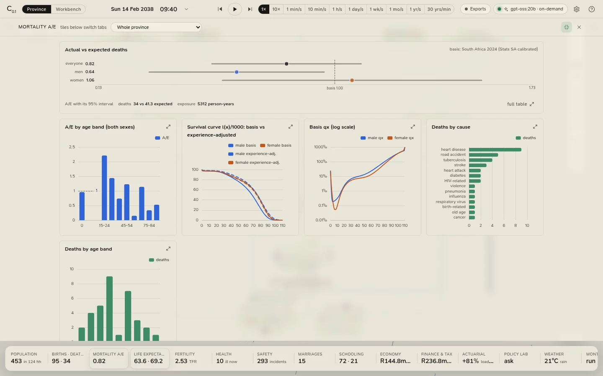

# Analytics

Everything the province does is counted, and the counts are along the bottom of the province view: the
**analytics strip**, sixteen tiles of headline figures. Click a tile and the **analytics drawer** slides up over the
map with that subject's cards; click the lit tile again (or <kbd>Esc</kbd>, or anywhere on the map) to close it.

<figure class="cl-shot" markdown>

<figcaption>The drawer at full screen, on Mortality A/E: deaths against the basis by age band and sex, survival curves, the basis qx and deaths by cause.</figcaption>
</figure>

## The tiles

| Tile | Shows | Opens |
|---|---|---|
| **Population** | Residents and households; children and over-65s | [Population](population.md#population) |
| **Births · deaths** | Births and deaths since the start, and this year | [Population](population.md#population) |
| **Mortality A/E** | Deaths against expected deaths on the basis | [Mortality and experience](mortality.md) |
| **Life expectancy** | e₀ on the basis for men and women, and adjusted for experience once there are enough deaths | [Mortality and experience](mortality.md) |
| **Fertility** | The realised TFR and births against the basis | [Fertility](population.md#fertility) |
| **Health** | Residents ill now, and in the ward | [Health](population.md#health) |
| **Safety** | Incidents, arrests and court cases | [Safety and the court](population.md#safety-and-the-court) |
| **Marriages** | Marriages, divorces and last Sunday's church attendance | [Social and church](population.md#social-and-church) |
| **Schooling** | At school and homeschooled | [Education](population.md#education) |
| **Economy** | GDP a year, inflation and the repo rate | [Economy and finance](economy.md), at the overview |
| **Finance & tax** | The Mutual Bank's deposits; the burial society's or SARS's state when either needs attention | [Economy and finance](economy.md), at the Mutual Bank |
| **Actuarial** | The burial society's premium loading over its pure risk premium | [The actuarial workbench](actuarial.md) |
| **Policy lab** | A lab job's progress | [The policy and stress lab](lab.md) |
| **Weather** | Today's high and condition, the season, the rain | [Weather](population.md#weather) |
| **Monte Carlo** | | [Monte Carlo](monte-carlo.md) |
| **Basis** | The basis hash | [The basis](#the-basis) |

A figure turns amber or red when it needs a look: A/E far from 1, a society whose premiums no longer cover its pure
risk premium, an insolvent scheme, a taxpayer in arrears, inflation above 6%.

**View › Analytics** in the desktop app opens every tab by name, including one the strip has no tile for: **The
burial society**, the scheme's surplus process (also in the finance workspace).

## The drawer

- **Cards.** Each subject is a set of cards: a chart or a table with its note. A card with a summary shows a small
  chart and a key, and its button (**full table**, **full chart** or **history**) opens the whole card; any card can
  be **enlarged**. <kbd>Esc</kbd> closes an enlarged card.
- **Full screen.** The ⤢ button in the drawer's header makes the drawer fill the window, and the cards grow to fill
  it; on a large screen every card of a tab fits at once.
- **Scope.** The picker in the header narrows the analytics to one city, settlement, household or person. It narrows
  the *composition* cards (the pyramid, chronic conditions, relationships, schooling); rates that only make sense
  for the whole population (A/E, fertility) stay province-wide, and the card says so.
- **The event ledger** is in the left panel, under **Events**: every birth, death, wedding, illness, incident,
  court case, weather event and economic event, newest first, filtered by *joy*, *sad*, *alert* or *danger*. Click
  one to go to whoever it involved.

## The basis

The **Basis** tile opens the assumptions the province lives on: the mortality table (qx by sex on a log
scale), every parameter and its value, the basis hash, and two downloads: **qx table (CSV)** (ages 0 to 110 by sex)
and **event ledger (CSV)** (every event the province has kept, with the people involved).

## Reading small numbers

The province is about four hundred people. A handful of them die in a year, and most cells of one province's
experience are empty, so every rate from one run is **noisy**, and the intervals say how noisy. Two tools exist for
exactly this:

- [Monte Carlo](monte-carlo.md) runs the same basis on many seeds and reports percentiles.
- The [policy and stress lab](lab.md) compares a change with the baseline seed by seed, which cancels most of the
  noise.

[Calibration and limits](../model/calibration.md) says what the province can and cannot be read for.
