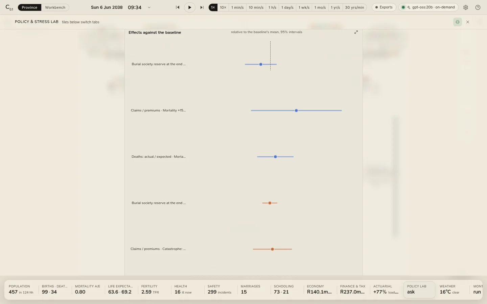

# The policy and stress lab

The lab answers questions of the form *what does this change do?* It runs the province as it is (the **baseline**)
and the province with the change (an **arm**) on the same seeds, side by side on the worker pool, and reports each
indicator's **paired effect** with a 95% interval. Open it from the **Policy lab** tile or **Run › Policy and
Stress Lab**.

<figure class="cl-shot" markdown>

<figcaption>The SAM life stresses after a run on eight seeds: each arm's effect on the indicators the question leads with, as a share of the baseline's mean, with its 95% interval.</figcaption>
</figure>

## Asking a question

1. **Pick a template.** The chips are grouped for **actuaries**, **governments** and **social development**; hover
   over one for its question. The [templates](../reference/templates.md) page lists every arm. The lab starts on the
   first, *SAM life stresses on the burial society*.
2. **Change its numbers**, if you like: the question's wording, and the value of every numeric parameter an arm
   changes (each input shows the default beside it). Shocks, tables and non-numeric changes are shown but not
   editable here.
3. **Choose seeds and years**: 2 to 64 seeds, 1 to 40 years (8 and 10 to start).
4. **from this province's basis**: tick it to start every arm, and the baseline, from the province as you have
   built it in the Scenario panel (its parameters, a table it lives on, its shocks) instead of the defaults.
5. **Run on the server.**

To add or remove arms, edit labels or shocks, or ask a question no template asks, write an
[experiment file](../workbench/experiment-files.md): **Open in the lab** shows any experiment file here, and running
one from the workbench opens its result here too.

!!! note "Years rebuild a template"
    Changing **Years** on a template rebuilds its arms from the template (a stress that lasts the whole run must
    last the new number of years), which puts any numbers you edited back to the template's.

## The cost

A job may ask for at most **800 province-years**: seeds × years × (arms + 1). The lab shows the estimate before you
run (about ten seconds of one worker per province-year, eight workers side by side) and refuses a job that is too
large, saying why. While a job runs, the bar counts runs done; **Cancel** drops the runs not yet started, and the
running ones stop at the end of the simulated day they are on. The job carries on while the drawer is closed, and
the **Policy lab** tile counts it.

## Reading the result

**Effects against the baseline**: a forest plot of the indicators the question leads with, each effect as a share of
the baseline's mean, with its 95% interval and a line at zero.

**Every indicator**: all 21 [indicators](../reference/indicators.md), the lead ones first: the baseline's mean over
the seeds, then for each arm the effect with its interval, and **better k/n**, the number of seeds in which the arm
moved the indicator the better way. An effect whose interval crosses zero is shown faint.

How an effect is computed:

- for each seed, the difference between the arm and the baseline on that seed;
- the **effect** is the mean of those differences;
- its **95% interval** is the mean ± t × s / √n, with Student's t on n − 1 degrees of freedom;
- **better k/n** counts the seeds whose difference went the indicator's better way (ties do not count).

Because the arm and the baseline share every random number the change does not touch, the differences are far less
noisy than the indicators themselves: a paired comparison needs far fewer seeds than two separate sets of runs. An
interval that crosses zero is an effect these seeds cannot tell from chance; more seeds narrow every interval.

## Keeping it

- **Save to workspace** (with a workspace open) writes the result into `results/<title>-<date>/` in the workspace:
  the runs and the effects as CSV, the whole result as JSON, a README with its provenance, and the experiment it was
  run from, so it can be run again. A run from an experiment file is saved there by itself.
- **Download CSV** saves the runs; **JSON** saves the whole result.
- **Recent experiments** lists the last fifty experiments the engine has kept; click one to show it again.
