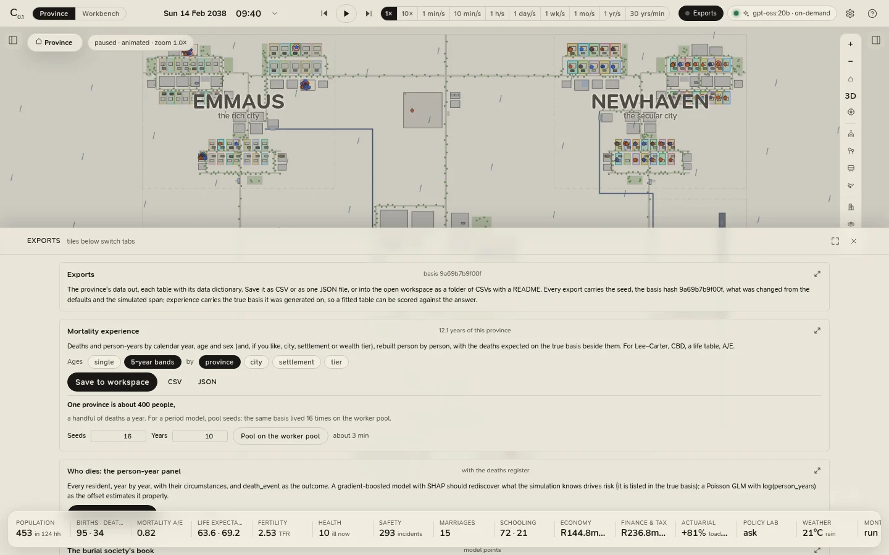

# Exports and data

The province's data goes out as plain tables, each with a data dictionary and its **provenance**: the app and its
version, when it was made, the simulated span, the seed, the basis and assumptions hashes, and every parameter that
differs from the defaults. A result can always be traced back to what produced it. The **Exports** chip in the top
bar (or **View › Exports**) opens them.

<figure class="cl-shot" markdown>

<figcaption>Exports: the province's mortality experience, the person-year panel, the burial society's model points and the economy, each to CSV, JSON or a folder of the workspace.</figcaption>
</figure>

## What you can export

| Export | Table(s) | One row per |
|---|---|---|
| **Mortality experience** | `unity_mortality_experience`: `year`, `age`, `age_width` (banded), `sex`, the group (if any), `person_years`, `deaths`, `expected_deaths`, `qx_basis` | Calendar year × age (single, or five-year bands) × sex, optionally by city, settlement or tier |
| **Who dies: the person-year panel** | `unity_person_years`: `person_id`, `year`, `age`, `sex`, `person_years`, `death_event`, and the person's city, settlement, tier, heritage, birthplace, schooling, job, income, household size, poverty, cover, chronic conditions, HIV status and vitality; and `unity_deaths`, the deaths register (cause included) | Resident × calendar year; death |
| **The burial society's book** | `unity_burial_society_model_points`: `policy_id`, `household_id`, `cover` (funeral or life), `age_at_entry`, `sex`, `sum_assured`, `policy_term`, `duration_mth`, `premium_pp` | Covered life × cover |
| **The economy, month by month** | `unity_economy_monthly`: CPI and inflation, the repo and prime rates, nominal and real GDP, unemployment and employment, the Gini of income and wealth, tax revenue, government spending, the fiscal balance, household disposable income, the saving rate, bank deposits and loans, the petrol price, Brent and the rand | Month |

The experience and person-year exports carry the **true basis** the province lived on (the table by single age and
sex, its improvement, and the individual risk factors), so a table fitted to the data can be scored against the
answer. The [policy and stress lab](../analytics/lab.md) exports its experiments the same way.

## Formats

Every export offers three:

| Format | What you get |
|---|---|
| **CSV** | The first table, as RFC 4180 CSV (a header row; empty cells for missing values). For the person-year export that is the panel, without the deaths register. |
| **JSON** | The whole export in one file: every table, the provenance and the true basis. |
| **Save to workspace** | With a workspace open: a folder `exports/<name>-<date>/` holding every table as CSV, a `README.md` (the provenance, the headline figures, the true basis and a data dictionary for every table), `export.json`, and `truth.json` when the export carries a true basis. |

## Experience, measured properly

Exposure in the experience exports is **central exposure**, rebuilt person by person: a resident counts on every day
from their first in the province (the start, their birth or their arrival) to the day before their death or
departure, at their age last birthday that day, cut at each 1 January. **Expected deaths** are the basis's daily
hazard summed over the same days, with improvement and without individual risk; `qx_basis` is the basis q,
exposure-weighted over the cell. Calendar years observed for less than half their days are left out, because a
period model reads every year as a whole one.

**One province is about four hundred people**, a handful of deaths a year, so most cells of one province's
experience are empty. **Pool on the worker pool** lives the province's basis on many seeds (16 by default, up to 64;
10 years by default, up to 40; at most 800 province-years) and pools their experience into one export. The person-year
panel describes each person **as at the end of observation** (or their death or departure): the engine keeps no
history of a job or an income.

## Living on a table of your own

**Import a mortality table (CSV)**, at the bottom of the tab, reads a table (see [Mortality
tables](../workbench/mortality-tables.md) for the format) and rebuilds the province on it, from day 0 on the same
seed, keeping its other parameters and any shocks. A/E is then measured against your table, the Exports chip reads
*Exports · basis*, and the card compares your table with the preset at key ages.

**Return to the preset basis and lift the shocks** goes back: it removes the table and every shock, keeps the
other parameters, and rebuilds from day 0.

## The format

Every export is a `scelo.exchange/1` document: an open, self-describing layout that R, Python, a spreadsheet or Scelo
IDE can read as it is. [The exchange format](exchange.md) describes it.
