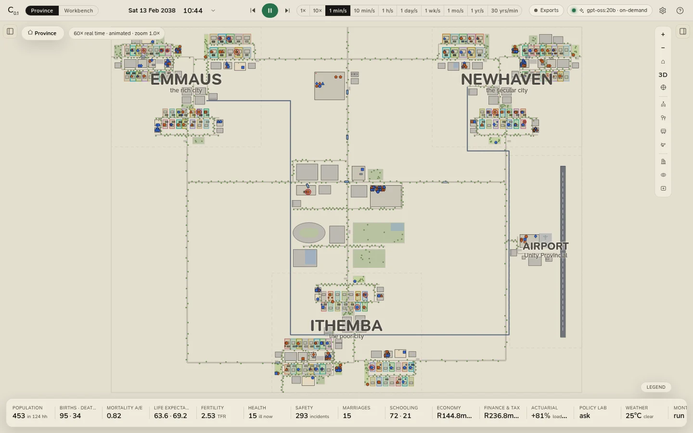

# Community Lab IDE

**A province you can run. On your machine.**

Community Lab IDE is a desktop IDE for actuarial agent-based simulation. It runs **Unity Province**: three cities,
the centre they share and an airport, about four hundred residents in a hundred households, every one of them an
agent living on published South African mortality and fertility bases. Every rand they earn, spend, borrow, insure
or pay in tax is posted to double-entry books; a burial society carries their risk; a central bank sets the repo
rate. Around the province is an IDE: a workbench of files that rebuild it on a basis of your own, run paired
experiments on a pool of workers, and script it from JavaScript. It runs entirely on your machine.

<figure class="cl-shot" markdown>

<figcaption>Unity Province on a Saturday morning: Emmaus, Newhaven and Ithemba around Unity Centre, joined by the roads and the Hyperline.</figcaption>
</figure>

-   :material-map-outline: **[The province](province/index.md)**

    The simulation, live: every resident on the map, a clock from real time to a year a second, an inspector for
    anyone, and a 3D close-up you can walk through.

-   :material-chart-box-outline: **[Analytics](analytics/index.md)**

    Mortality experience with intervals, fertility, health, safety, the economy and the books, an actuarial
    workbench, a policy and stress lab, and Monte Carlo.

-   :material-file-code-outline: **[The workbench](workbench/index.md)**

    Province files, experiment files and scripts in a folder of your own, an editor that knows their shapes, and a
    run for each.

-   :material-export-variant: **[Exports](exports/index.md)**

    Experience, the person-year panel, the society's model points and the economy, each with its provenance and the
    true basis, to CSV, JSON or the workspace.

## What makes it different

- **An explicit basis.** Every assumption is a parameter with its source, and the whole basis is hashed onto every
  export. The same seed and basis give the same province and the same history, on any machine.
- **Experience you can measure.** Exposure and expected deaths accrue day by day, by age band and sex, so actual
  against expected is measured the way an actuary measures a portfolio, with intervals that say how much a small
  province can tell you.
- **Experiments that are paired.** Each process draws its own random numbers, so a change and the baseline share
  everything the change does not touch: the lab compares them seed by seed, with Student-t intervals.
- **Books that balance.** A standard chart of accounts, a hash-chained general journal, statements on IFRS for SMEs
  lines, SARS's 2026/27 tables, a mutual bank under IFRS 9, and an audit that re-verifies the chain.
- **Offline and open.** Nothing needs a network or an account. Province files, experiment files and scripts are
  plain text; every export is an open, self-describing format.

## Who it is for

Actuaries who want to see a published basis play out in a population they can inspect, measure experience against
it, and stress a small insurance scheme and a small economy; social scientists and policy analysts who want to try a
change on a province before anyone lives through it; and anyone teaching the life-course, the economy or the books
from the level of the person.

## How this manual is organised

| Section | What is in it |
|---|---|
| [Installation](installation/index.md) | Linux, Windows and macOS, and what happens at first launch |
| [Getting started](getting-started.md) | A first hour, end to end |
| [The province](province/index.md) | The map, time, the inspector, conversations, the 3D close-up, the scenario |
| [Analytics](analytics/index.md) | Every tab of the drawer, the actuarial workbench, the lab, Monte Carlo |
| [The workbench](workbench/index.md) | Workspaces, province files, experiment files, scripts and their API |
| [Exports and data](exports/index.md) | What goes out, and the format it goes out in |
| [The model](model/index.md) | How the province works, its calibration and limits, the model description and every assumption |
| [Reference](reference/index.md) | Basis parameters, indicators, templates, shortcuts, settings, files, the API, troubleshooting, building from source, the license, what is new |

This manual describes **Community Lab IDE 0.1.0**, licensed under the [Scelo IDE Source-Available License
v1.1](license.md).
