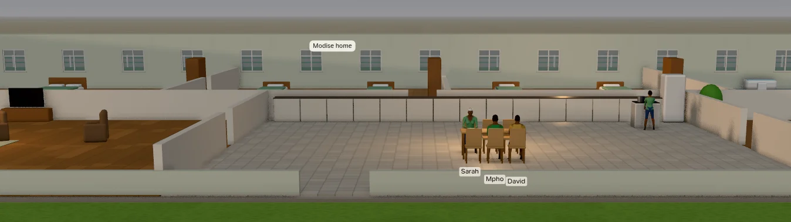

# The 3D close-up

Zoom in past the room plans and the map becomes a three-dimensional scene: the same province, the same people and
the same minute, drawn as a doll's house you can walk through. Nothing in it is decoration. Every person stands
where the simulation has them, doing what their plan says, dressed for the day's weather; every car is where its
journey has got to.

<figure class="cl-shot" markdown>

<figcaption>A household at dinner in the 3D close-up. The houses have no roofs and low front walls, so you look into the rooms; every resident is built from the simulation's own record of them.</figcaption>
</figure>

## In and out

**Zoom in** with the wheel. Past the room plans the scene fades in over the map, straight down and north-up, at the
map's own scale, so nothing jumps. Keep zooming and the camera **swings down** from straight above to a low view
along the street, then settles at eye level; closer still, it only comes nearer. The first time, the app loads the
3D people (about 14 MB, from the app itself; nothing is downloaded).

**Zoom out** with the wheel and the camera lifts back to the plan. The **−** and **⌂** buttons on the right, the
**Province** step of the breadcrumb and **Esc** all take you back out too.

**Turn it off** with the **3D** button in the zoom column on the right (or **View › 3D Close-up**, or **Y** on a
game controller): the map then stays flat at every zoom, down to the room plans. The choice is remembered.

The close-up needs a GPU with **WebGL 2**. Without one the map simply stays flat; everything else in the app works
the same.

## What you see

**The province, outdoors.** Flat ground, roads with their markings, lawns and trees that change colour with the
season and sway with the day's wind, street lamps that glow at night, the Hyperline's deck on its pylons with the
stations' platforms, the stadium, the runway, and every plot's fence in its household colour.

**Buildings without roofs.** The back and side walls stand full height, with windows; the front (south) walls are
low and the partitions half height, so a camera facing north looks straight into the rooms. Every room is
furnished as the simulation lays it out: beds, pews, desks, stoves, market stalls, the pulpit, the ward's beds.
Sleepers lie under a duvet in their household's colour (pale blue in the wards), and partners keep their own side
of a double bed.

**People, built one by one.** Each resident's body follows their sex, age, build and ancestry; children's faces
take their features from their parents; hair colour comes from inherited pigment and greys with age. Clothes
follow the day: a daily outfit with a top in a shade of the household colour, uniforms at work (police, nurses,
doctors, the pastor, magistrates, teachers, bus drivers, pilots, builders, farm workers), school uniform on school
days, Sunday best at church, weddings and funerals, coats and beanies in the cold, night clothes in bed.

They move as they live: walking with a stride of their own, shifting their weight while they wait, sitting back
in a chair or on the edge of a pew, sleeping and turning over, cooking, praying, singing the hymns. People in a
conversation stand in a circle, look at whoever spoke last, and gesture with the conversation's tone.

**Vehicles, with their passengers.** Household cars and bakkies (people ride in the load bin), patrol cars with
their light bars, ambulances with the patient on a stretcher, minibus taxis, buses, Hamba e-hailing cars (the roof
sign is teal when online, amber on a surge trip, grey when offline), the Hyperline's capsule gliding between
stations, and the aeroplanes on the ground. Passengers sit in their seats; headlights, brake lights and indicators
work as they should.

**Light and weather.** The sun stands where it would at the province's latitude, on that day, at that hour: golden
in the evening, moonlight at night, dimmed under cloud. At night the occupied rooms nearest the camera are lit.
Rain and snow fall outdoors and never inside a room; storms are heavier, lightning lights the whole scene, and fog
closes the distance in. A storm, a cold snap or snow can be forced from the [clock](time.md#forcing-the-weather).

**Labels.** Names float under people's feet when they are close enough to read (the selected person's carries
their age, job, plot and what they are doing); speech bubbles and the ♪ of the hymns are drawn over the scene, and
buildings are named over their entrances.

Not shown in 3D: incidents, aeroplanes in flight, and residents who are away from the province.

## Moving about

The mouse and keys work as in **Unreal Engine's editor viewport**, with its own constants. Every movement scales
with the distance to what the camera is looking at, so the same gesture crosses a room close up and a city from
above (turn that off in [Settings](../reference/settings.md#navigation)).

| Mouse | Does |
|---|---|
| Right button, drag | Look about (0.2° a pixel; the cursor hides while you look) |
| Left button, drag | Up and down: move along the ground. Left and right: turn |
| Middle button, or left and right together | Slide sideways, and straight up and down |
| <kbd>Alt</kbd> or <kbd>Ctrl</kbd> + left | Orbit what the camera looks at |
| <kbd>Alt</kbd> or <kbd>Ctrl</kbd> + right | Dolly toward what the camera looks at |
| <kbd>Alt</kbd> or <kbd>Ctrl</kbd> + middle | Track along the camera's own right and up |
| Wheel | Dolly toward the ground under the cursor |
| Wheel with a button held | Camera speed: ×1.1 a notch up, ×0.9 down |
| Left click | Pick a person or a building |

| Keys | Does |
|---|---|
| <kbd>W</kbd> <kbd>S</kbd> / <kbd>A</kbd> <kbd>D</kbd> | Fly forward and back / sideways, **with a mouse button held** |
| <kbd>E</kbd> <kbd>Q</kbd> | Up and down in the world, with a button held |
| <kbd>R</kbd> <kbd>F</kbd> | Up and down along the camera's own up, with a button held |
| <kbd>C</kbd> <kbd>Z</kbd> | Narrow and widen the lens, with a button held; it springs back when you let go |
| Arrows, numpad <kbd>8</kbd> <kbd>2</kbd> <kbd>4</kbd> <kbd>6</kbd> | Forward, back and sideways, with or without a button |
| <kbd>PgUp</kbd> <kbd>PgDn</kbd>, numpad <kbd>9</kbd> <kbd>7</kbd>, <kbd>+</kbd> <kbd>−</kbd> | Up and down in the world |
| Numpad <kbd>1</kbd> <kbd>3</kbd> | Widen and narrow the lens |
| <kbd>Home</kbd> | Level the view: facing north, horizontal, the default lens, flight stopped |

Flight accelerates and coasts, as Unreal's does. *Fly with W A S D* in [Settings](../reference/settings.md#navigation)
can make the flight keys work without a button, or turn them off. While they work without a button, the app's own
single-key shortcuts (Space, the digits, <kbd>F</kbd>, <kbd>[</kbd>, <kbd>]</kbd>, <kbd>L</kbd>, <kbd>?</kbd>) pause in the 3D view;
<kbd>Esc</kbd> always works.

## A game controller

A standard controller (the first one connected) follows Unreal's joystick scheme. The app says when one connects.

| Control | On the flat map | In 3D |
|---|---|---|
| Left stick | Pan | Move |
| Right stick | | Look |
| Right / left trigger | Zoom in / out | Up / down |
| Left / right bumper | | Widen / narrow the lens (it springs back) |
| D-pad | Pan | Up and down: movement speed (0.25 to 5). Left and right: turning speed (0.25 to 3) |
| A | Pick the building at the centre | Pick the nearest person at the centre, otherwise the building |
| B | Stop following, otherwise deselect, otherwise step out | The same |
| X | Follow or unfollow the selected person | The same |
| Y | Turn 3D on or off | The same |
| View | The legend | The same |
| Start | Play or pause | The same |
| Stick clicks | Level the view | The same |

## Picking and following

A **click** on a person selects them, or the conversation they are in; a click on a building selects its household
(for a house) or the building. Vehicles are not selectable: pick a passenger. Hovering shows who or what is under
the cursor. The selected person stands on a green ring, and the members of a selected household on rings in its
colour.

**Double-click** a person to follow them: the camera keeps them in view as they go about their day. **F**, the
target button on the right, the inspector's **follow** and **X** on a controller do the same. Any drag, dolly, key
or stick movement ends the follow, and so does **Esc**.

The [inspector](inspector.md) shows the selected person or place, as on the flat map; open it with **]**.

## Performance

The scene draws the **140 nearest people**; in a full church or the stadium, those further back are not drawn.
People near the camera are built in full detail and animated every frame; further away they become lighter
figures, animated less often, as MetaHuman's levels of detail do. Buildings, people and vehicles are built a few
at a time as the camera comes near, so a new street fills in over a moment. There are no quality settings.

The close-up and a local language model both want the GPU's memory. The app loads the model only when a
conversation first needs it, not at start, and a 20b model holds about 7 GB once loaded. On a laptop GPU, close
other GPU-heavy programs, or choose a smaller model in [Settings](../reference/settings.md), if the close-up
stutters while conversations are being scripted.
