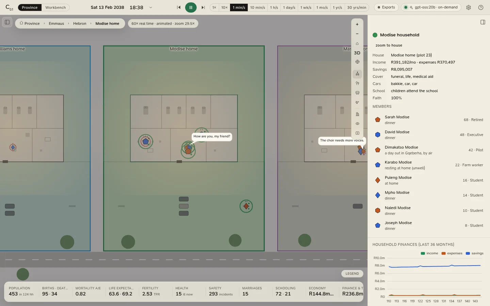

# People, households and places

Click a person, a house or a building on the map and the **inspector** (on the right; <kbd>]</kbd> opens it) shows
what the simulation knows about them. The **Households** and **People** lists in the left panel (<kbd>[</kbd>) find
anyone without the map: the People list searches by name, job or personality type.

<figure class="cl-shot" markdown>

<figcaption>A household at dinner time: the rooms, the members ringed in the plot's colour, and the inspector with the household's finances and this month's accounts.</figcaption>
</figure>

With nothing selected, the inspector lists the **key people** (the pastor, the district medical officer, the
doctor, a police officer, the magistrate; click one to follow them) and the **live conversations**.

## A person

| Field | Shows |
|---|---|
| **Age** | Age, sex and stage of life. |
| **Type** | Personality type and its shape. |
| **Work** | Job, workplace and monthly income. |
| **Council** | The council seat they hold, if any. |
| **Payslip** | This month's gross pay, PAYE, UIF and net pay. |
| **SARS** | Their latest assessment (tax, and a refund or an amount owing), or the tax year to date. |
| **Education**, **Family** | Schooling; spouse, parents and children. |
| **Home** | Their household, plot, settlement and city. |
| **Now** | What they are doing, from when to when, and where: a building, a vehicle ("aboard the Hyperline", "in a minibus taxi", "driving for Hamba with a fare aboard"), a platform or a bus stop. |
| **Faith**, **Mood** | How likely they are to be at church; mood and stress, and whom they are grieving for. |
| **Health** | Health and vitality, any illness and its severity, whether it is being treated or they are in the ward, chronic conditions, a pregnancy and when it is due. |
| **Record** | Arrests, if any. |

Below that: their **Big Five** scores, **Today** (the day's plan as a timeline), their **Relationships** (the
strongest fourteen; click a name to go to that person) and their **Life history**.

Buttons: **follow**, **household** (selects their household), **conversation** (while they are in one), and
**Talk to …**, which opens a conversation with them (see [Conversations](conversations.md#talking-to-a-resident)).

## A household

| Field | Shows |
|---|---|
| **House**, **Income**, **Savings** | Their plot, monthly income and savings, and whether they are below the poverty line. |
| **Cover**, **Cars** | Funeral, life and medical cover; cars. |
| **School**, **Faith** | Whether the children go to school or are homeschooled; how the household stands on church. |
| **Members** | Click one to select and follow them. |

Then **Household finances (last 36 months)** (income, expenses, savings) and **Accounts · this month**: an income
statement that ends with what was saved this month, and a balance sheet that ends with net worth. **open the
ledger** opens the household's own books in the [finance workspace](../analytics/economy.md#the-books); **tax**
opens its tax position there. **zoom to house** flies to their plot.

## A building

Its kind, its rooms and **who is inside now**, by name. The Mutual Bank's building also shows its balance sheet and
**open the bank's books**; the cemetery counts its graves.

## A conversation

Click someone who is talking, close up, and the inspector shows the **conversation**: who is in it, where, its
tone and topic, and its whole **transcript** so far, line by line with the time. See
[Conversations](conversations.md).

## An incident

Incidents are selected from the Safety tab's list of recent incidents: when and where, what happened, who was
involved, the loss and any court case.

Vehicles cannot be selected; select a passenger instead, and their card says what they are travelling in.
