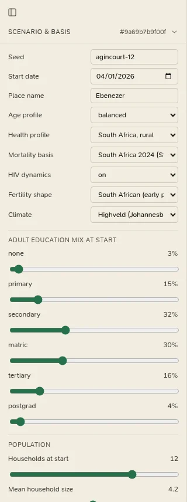

# Scenario and basis

Every assumption the province lives on is a parameter of its **basis**. The *Scenario & basis* section of the left
panel (<kbd>[</kbd>) changes the most used of them; a [province file](../workbench/province-files.md) in the workbench
can change any of them, and add a mortality table and timed shocks.

<figure class="cl-shot" markdown>

<figcaption>Scenario &amp; basis: the seed, the presets and the sliders. Changes are a draft until you press Rebuild province.</figcaption>
</figure>

## Changing the scenario

1. Open the left panel and the **Scenario & basis** section. Its header shows the current basis hash.
2. Change what you like. The changes are a **draft**: nothing happens to the province yet.
3. Press **Rebuild province**. The province is rebuilt **from day 0, on the same seed**, so the run before and the
   run after are comparable: everything the change does not touch happens exactly as before.

**defaults** puts the draft back to the default basis (press **Rebuild province** to apply it). **Monte Carlo…**
opens the [Monte Carlo](../analytics/monte-carlo.md) tab, to run many seeds of the basis you have built.

The app remembers the basis you built and starts on it next time.

## What the panel sets

**The run and its presets**

| Field | Default | Choices |
|---|---|---|
| Seed | `agincourt-12` | Any text. The same seed and basis give the same province. |
| Start date | 4 January 2026 | |
| Place name | Ebenezer | The original village's name, carried into the first city's institutions. |
| Age profile | balanced | young (many children), balanced, ageing |
| Health profile | South Africa, rural | South Africa, rural; South Africa, urban; developed country |
| Mortality basis | South Africa 2024 (Stats SA calibrated) | the four [presets](../reference/basis.md#mortality-presets) |
| HIV dynamics | on | on, off |
| Fertility shape | South African (early plateau) | South African, late (developed) |
| Climate | Highveld (Johannesburg) | Highveld, Western Cape (Stellenbosch), KZN coast (Durban), Temperate north (generic) |
| Adult education mix at start | 3 / 15 / 32 / 30 / 16 / 4% | none, primary, secondary, matric, tertiary, postgraduate; used as relative weights |

**The sliders**

| Group | Sliders (default) |
|---|---|
| Population | Households at start (12), Mean household size (4.2), Male share at birth (0.503), Homeschool share (15%), Matric → tertiary (35%) |
| Mortality and health | Mortality improvement a year (1.0%), Widowhood mortality × (1.6), Poverty mortality × (1.15), Clinic care quality (55%), Seasonal flu attack rate (12%) |
| Fertility and family | Total fertility rate (2.41), Extra contraception share (0%), Peak marriage age, men (30) and women (27), Courtship hazard a year (28%), Divorce hazard a year (0.6%), Church attendance (95%) |
| Migration and safety | Youth emigration a year (5%), Vacant house re-let a year (25%), Intruder visits a year (6), Disputes per 100 people a year (25), Police effectiveness × (1), Road accidents per 1,000 km (0.0035), Car ownership (60%), Hyperline cruise in Mach (5) |
| Economy and insurance | Funeral premium (R120 a month), Funeral benefit (R25,000), Life cover sum (R100,000), Life premium (R120 a month per adult), Households with funeral cover (75%), life cover (35%) and medical aid (30%), Scheme opening reserve (R200,000), Child grant (R580 a month), Old-age grant (R2,400 a month), Poverty line (R1,634 a person a month), Retirement age (65) |

!!! note "Ebenezer's numbers"
    *Households at start*, the education mix, car ownership and the three cover shares are Ebenezer's, the original
    village's. Every other settlement takes its wealth tier's profile, so the default province still starts with
    100 households. A province file can set the tiers' shares too (`basis.tiers`).

[Basis parameters](../reference/basis.md) gives every parameter's meaning, range and default, including those the
panel does not show: the repo rate and inflation at the start, the minimum wage, the bank's capital, tithes and tax
indexation, the settlement tiers, the region's name.

## Beyond the panel

| To | Use |
|---|---|
| Change a parameter the panel does not show | A [province file](../workbench/province-files.md) with it in `basis` |
| Live on a mortality table of your own | **Exports › Import a mortality table (CSV)**, or a province file's `mortality` |
| Put the province through a pandemic, a rate stress or an oil shock | A province file's `shocks` |
| Save the scenario you built as a file | **File › New › The Province on Screen, as a File** |
| Compare a change against the province as it is, with intervals | The [policy and stress lab](../analytics/lab.md), or an [experiment file](../workbench/experiment-files.md) |

## The basis hash

The whole basis (every parameter, the seed, a supplied table and any shocks) is fingerprinted as the **basis
hash**, shown in the panel's header, on the *Basis* tile of the analytics strip, and on every export. The same hash
means the same province. The **assumptions hash** leaves out the seed and the cosmetic fields (names, the
Hyperline's speed), so every seed of one basis shares it.
