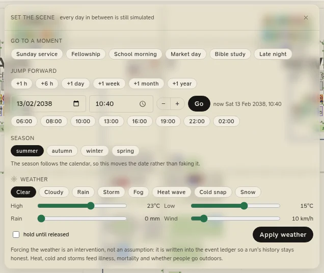

# Time and the clock

The province's clock runs from real time to a year every second. Whatever the speed, the same day step decides who
is born, falls ill, marries, works and dies, so **an outcome never depends on the speed you watch it at**.

## Playing and pausing

The province opens **paused**, at dawn on its first day. <kbd>Space</kbd> (or the play button in the top bar) starts
and stops the clock. **Step** pauses and moves on one simulated hour. **Rewind** rebuilds the province at day 0 on
the same seed and basis: the same people, the same history to come.

## Speeds

| Key | Speed | Simulated time a second | Mode |
|---|---|---|---|
| <kbd>1</kbd> | 1× | a second (real time) | animated |
| <kbd>2</kbd> | 10× | ten seconds | animated |
| <kbd>3</kbd> | 1 min/s | a minute (the default) | animated |
| <kbd>4</kbd> | 10 min/s | ten minutes | animated |
| <kbd>5</kbd> | 1 h/s | an hour | animated |
| <kbd>6</kbd> | 1 day/s | a day | time-lapse |
| <kbd>7</kbd> | 1 wk/s | a week | time-lapse |
| <kbd>8</kbd> | 1 mo/s | a month | time-lapse |
| <kbd>9</kbd> | 1 yr/s | a year | time-lapse |
| <kbd>0</kbd> | 30 yrs/min | half a year | time-lapse |

The field beside the speed buttons takes any rate in **simulated years a minute** (0.01 to 100,000), for any
horizon you like. The map's corner shows the speed actually achieved: a slow machine at a fast speed may fall short
of it.

**Animated** (up to an hour a second): people walk the roads, drive, take the bus and the Hyperline, and hold
conversations you can zoom into. **Time-lapse** (faster): only the daily processes run, and people are shown where
their plan for the day puts them. Conversations and intruders happen only in the animated day.

## Setting the scene

Click the **clock** in the top bar. Every jump moves the clock **forward**, and every day in between is still
simulated, in full: only the animation is skipped.

<figure class="cl-shot" markdown>

<figcaption>Set the scene: go to a moment, jump forward, move to a season, or force the weather.</figcaption>
</figure>

**Go to a moment:**

| Moment | Goes to |
|---|---|
| Sunday service | The next Sunday at 09:00, as the congregation gathers |
| Fellowship | The next Sunday at 11:05, when the congregation mingles after the service |
| School morning | The next Monday at 07:30 |
| Market day | Saturday at 10:00 |
| Bible study | Wednesday at 18:30, at the church hall |
| Late night | 01:00, when the province is asleep |

**Jump forward** by an hour, six hours, a day, a week, a month (30 days) or a year (365 days); or pick a date and a
time and press **Go**. The row of times under the time field (06:00, 08:00, 10:00, 13:00, 16:00, 19:00, 22:00,
02:00) sets one in a click. A single jump goes at most three years ahead; for longer, use the time-lapse speeds.

**Season** moves to the first day of the next summer, autumn, winter or spring, at 09:00. The season follows the
calendar and the hemisphere of the climate, so this moves the date rather than faking the season.

Time only runs forward. To go back, **rewind**, which rebuilds the province from the same seed.

## Forcing the weather

The same panel can **force the weather**, so you can watch the province meet a storm, a heat wave or a cold snap
without waiting for one:

1. Pick a condition: *Clear*, *Cloudy*, *Rain*, *Storm*, *Fog*, *Heat wave*, *Cold snap* or *Snow*. Each loads its
   own figures (a heat wave is 38 °C by day and 24 °C by night, a storm 28 mm of rain in 42 km/h of wind).
2. Adjust the **High**, **Low**, **Rain** and **Wind** sliders if you like.
3. Tick **hold until released** to keep it day after day, or leave it to lapse at midnight.
4. Press **Apply weather**. **release** hands the weather back to the climate model.

Forced weather is an **intervention, not an assumption**: it is written into the event ledger, with the figures,
so a run's history says plainly where its weather came from, and the clock shows a *forced* badge. Heat, cold and
storms feed illness and mortality, and whether people go outdoors. The season is never forced: it always follows
the calendar.
