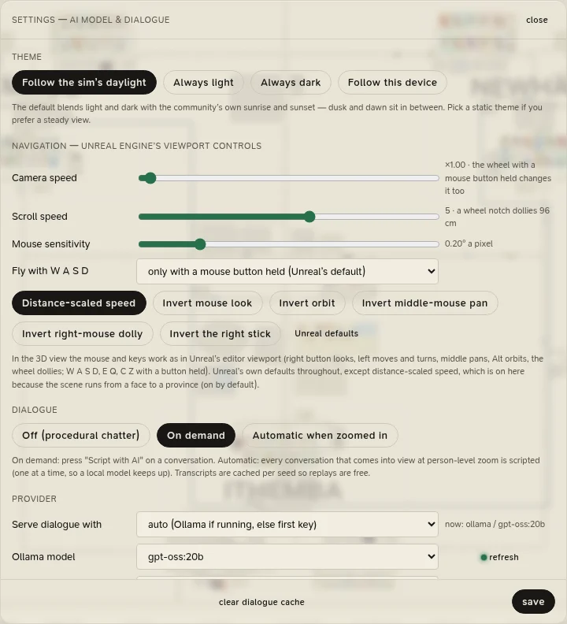

# Settings

Open Settings with the gear in the top bar, the model chip, or <kbd>Ctrl</kbd>+<kbd>,</kbd> in the desktop app.
<kbd>Esc</kbd> or **close** closes it. The theme, navigation and dialogue sections apply at once; the provider and the
keys apply when you press **save**.

<figure class="cl-shot" markdown>

<figcaption>Settings: the theme, the 3D navigation, the dialogue mode, and the model that scripts conversations.</figcaption>
</figure>

## Theme

| Choice | |
|---|---|
| **Follow the sim's daylight** (the default) | The app blends from light to dark with the province's own sunrise and sunset; dusk and dawn sit in between. |
| **Always light**, **Always dark** | A steady theme. |
| **Follow this device** | The system's light or dark setting. |

## Navigation

Unreal Engine's viewport controls, for the [3D close-up](../province/3d.md).

| Setting | Range | Default |
|---|---|---|
| **Camera speed** | 0.33 to 32 (the wheel with a mouse button held goes further) | 1 |
| **Scroll speed** | 1 to 8: how far a wheel notch dollies (96 cm at 5, at 10 m from what the camera looks at) | 5 |
| **Mouse sensitivity** | 0.01° to 1° a pixel | 0.20° |
| **Fly with W A S D** | *only with a mouse button held* (Unreal's default), *always*, *never* | only with a button held |
| **Distance-scaled speed** | Every movement scales with the distance to what the camera looks at | on |
| **Invert mouse look**, **Invert orbit**, **Invert middle-mouse pan**, **Invert right-mouse dolly**, **Invert the right stick** | | off |

**Unreal defaults** puts them all back.

## Dialogue

| Mode | |
|---|---|
| **Off (procedural chatter)** | No model is asked. |
| **On demand** (the default) | A conversation is scripted when you press **Script with AI**. |
| **Automatic when zoomed in** | The conversation in view is scripted, one at a time, while the clock runs at an animated speed and you are zoomed in close. |

See [Conversations](../province/conversations.md).

## Provider

| Setting | |
|---|---|
| **Serve dialogue with** | *auto* (Ollama if it has a model, otherwise the first hosted provider with a key), *Ollama (local)*, *Anthropic Claude*, *OpenAI*, *Google Gemini*, *OpenAI-compatible endpoint*. The line under it says which provider and model are in use now. |
| **Ollama model** | The models installed in Ollama; **refresh** looks again (needed if Ollama was started after the app). Without a choice, the first of the gpt-oss, Gemma, Qwen and Llama families. |
| **gpt-oss reasoning** | *low* (the fastest, and recommended for dialogue), *medium*, *high*. gpt-oss cannot switch its reasoning off. |
| **Compatible base URL** | For an OpenAI-compatible endpoint, such as `http://localhost:1234/v1` (LM Studio, vLLM, Groq…). |
| **Model** for each hosted provider | Left empty: `claude-sonnet-4-6`, `gpt-4o-mini`, `gemini-2.0-flash`, `local-model`. |

## Keys

API keys for Anthropic, OpenAI, Google Gemini and an OpenAI-compatible endpoint. Each shows *configured* once set.
They are kept in the app's storage on this machine and handed to the engine, which holds them in memory and sends
them only to their provider.

## The cache

**clear dialogue cache** empties the cache of scripted conversations and says how many it removed.

## What the app remembers

| | Remembered |
|---|---|
| The basis you built in the Scenario panel | Yes; the province starts on it next time, at day 0 |
| The view, the side panels, the dialogue mode, the 3D close-up on or off | Yes |
| Navigation, theme, provider, keys | Yes |
| The workbench's folder, open files, expanded folders and pane sizes | Yes |
| The running province, the speed, the legend | No: each launch starts the province afresh, paused |
