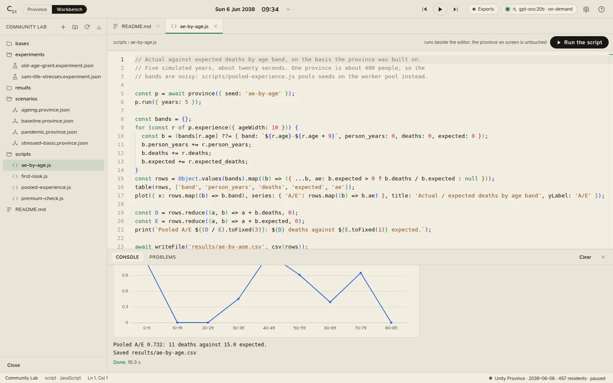

# The workbench

The workbench is Community Lab IDE's second view: a folder of ordinary files, an editor that knows their shapes, a
run for each kind of file, and a Console and a Problems list below. Switch to it with **Ctrl+2** (or **Workbench** in
the top bar), and back to the province with **Ctrl+1**. The province keeps its own clock while you are here: the play
button in the top bar still runs it.

<figure class="cl-shot" markdown>

<figcaption>The workbench after running the sample's <code>scripts/ae-by-age.js</code>: the workspace in the explorer, the script in the editor, and its table and plot in the Console.</figcaption>
</figure>

## Workspaces

A **workspace** is any folder. With none open, the workbench shows its welcome screen, with two ways in:

- **Start from the sample**: **Create the sample workspace** writes the [sample](sample.md) (four provinces, two
  experiments, four scripts and a mortality table, every one runnable) into a new folder, `Community Lab` in your
  Documents folder unless you choose another place.
- **Open a folder**: any folder works. **File › Open Folder** (<kbd>Ctrl</kbd>+<kbd>O</kbd>) does the same at any time.

The IDE remembers the folder and the files you had open, and reopens them next time. **File › Open Recent** and the
welcome screen list the folders you used lately. **File › New Workspace** closes the current workspace and shows the
welcome screen again; **File › Close Workspace** just closes it.

Everything in a workspace is a plain text file: version it with git, diff it, review it, share it, open it in any
other editor.

!!! warning "Save before you switch folders"
    Opening a different folder replaces the open tabs, and unsaved changes in them are lost without a question.
    Closing the workspace, New Workspace, closing the window and quitting all ask first.

## The layout

| Part | What it is |
|---|---|
| **Explorer** (left; <kbd>Ctrl</kbd>+<kbd>B</kbd>) | The folder's files. |
| **Editor** (middle) | A tab for each open file, and above it the file's path, what running it will do, and **Run**. |
| **Console** and **Problems** (below; <kbd>Ctrl</kbd>+<kbd>J</kbd>) | What runs print, their tables, plots and progress; and every error and warning, by file and line. |
| **Status bar** (bottom) | The workspace, the file's kind, the cursor's line and column, and on the right the province's date, residents and speed (click it to go to the province). |

Drag the edges between them to resize; the sizes are remembered.

## The explorer

Folders come first, then files, in order. Hidden files (names beginning with a dot, except `.gitignore`) and
`node_modules`, `.git`, `.hg`, `.svn`, `__pycache__`, `.venv` and `venv` are left out; a very large folder is listed to
a few thousand entries and eight levels deep. The explorer refreshes itself every few seconds, and after anything
the IDE writes.

Hover over an entry for its tools: **▶** runs a file that can run; **Rename** renames a file or a folder (open tabs
follow it); the bin moves it to the trash (the system's trash in the desktop app), after asking. A file with
problems has its name tinted.

The header's **+** makes a new file, in the folder for its kind:

| Item | Creates |
|---|---|
| **Province** | `scenarios/untitled.province.json`: a seed of its own and an empty basis |
| **Experiment** | `experiments/untitled.experiment.json`: the first of the lab's templates, on 8 seeds and 10 years |
| **Script** | `scripts/untitled.js`: a starter script |
| **Note** | `notes/note.md` |
| **The province on screen** | `scenarios/<region>-<seed>.province.json`: the province you built in the Scenario panel, every parameter that differs from the defaults, its table and its shocks |

If the name is taken, the new file is `untitled 2`, `untitled 3` and so on. The header also has **New folder**,
**Refresh** and **Collapse folders**. The same items are under **File › New** in the desktop app.

## Files that run

**Ctrl+Enter**, the **Run** button, or **▶** in the explorer runs a file. A file is saved before it runs. **Stop**
(**Ctrl+Shift+Enter**, or the button that replaces Run) ends a run.

| File | What running it does |
|---|---|
| [`*.province.json`](province-files.md) | Rebuilds the province on screen on it, and switches to it. |
| [`*.experiment.json`](experiment-files.md) | Runs a paired experiment on the worker pool, opens it in the lab, and keeps the result in `results/`. |
| [`*.js`](scripts.md) | Runs a script beside the editor, with the engine, the worker pool and the workspace at hand. |

The line above the editor says what a run will do before you start it: for an experiment, how many runs and
province-years it will take and roughly how long.

An error stops a run, and its reasons are listed in **Problems** and in the Console. A basis value the engine does
not take (an unknown name, a value outside its range) is a **warning**: that value is left out, named, and the rest
of the file is applied.

## Other files

| File | Opens as |
|---|---|
| CSV, TSV | A table of its first 500 rows, with **Edit as text** |
| `README.md` | A preview, with **Edit as text** |
| JSON, Markdown, JavaScript, any other text | Text, in the editor |

Binary files, and files over 5 MB, are not opened. A [mortality table](mortality-tables.md) is a CSV a province can
live on.

## The editor

The editor is the one VS Code uses (Monaco). For province and experiment files it checks the file against its
schema as you type, completes every field and every [basis parameter](../reference/basis.md), and shows each
parameter's meaning, range and default on hover; a wrong value is underlined before anything runs. For scripts it
completes and checks the [script API](script-api.md).

## Saving

**Ctrl+S** saves the file in front and **Ctrl+Shift+S** saves them all. A tab with unsaved changes carries a dot, and
closing it asks whether to save.

The IDE writes a file by writing a temporary copy and renaming it over the original, so a crash never leaves half a
file. It will not save over a file that has changed on disk since you opened it (another editor, a sync folder):
the save is refused, and a bar above the editor offers **Reload from disk** or **Keep mine and overwrite**.

## Safety

Paths never leave the workspace: the engine resolves every path inside the folder and refuses `..`, absolute paths,
and links that lead somewhere else. It answers requests from this machine only.

## Shortcuts

| | |
|---|---|
| Run the file / Stop | <kbd>Ctrl</kbd>+<kbd>Enter</kbd> / <kbd>Ctrl</kbd>+<kbd>Shift</kbd>+<kbd>Enter</kbd> |
| Save / Save all | <kbd>Ctrl</kbd>+<kbd>S</kbd> / <kbd>Ctrl</kbd>+<kbd>Shift</kbd>+<kbd>S</kbd> |
| Close the file | <kbd>Ctrl</kbd>+<kbd>W</kbd>, or middle-click its tab |
| Explorer / Console and Problems | <kbd>Ctrl</kbd>+<kbd>B</kbd> / <kbd>Ctrl</kbd>+<kbd>J</kbd> |
| Province / Workbench | <kbd>Ctrl</kbd>+<kbd>1</kbd> / <kbd>Ctrl</kbd>+<kbd>2</kbd> |
| New province file / Open a folder | <kbd>Ctrl</kbd>+<kbd>N</kbd> / <kbd>Ctrl</kbd>+<kbd>O</kbd> (desktop app) |

On a Mac, <kbd>Cmd</kbd> in place of <kbd>Ctrl</kbd>.
